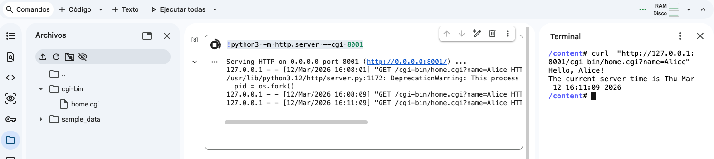

# CGI

CGI (Common Gateway Interface) es un estándar que permite a los servidores web ejecutar programas externos para generar contenido dinámico.

En lugar de servir solo archivos estáticos (HTML, imágenes), CGI permite que un script genere respuestas basadas en la entrada del usuario, datos de un formulario o información del sistema.

- Finales de los 80 / principios de los 90: La web era principalmente estática (solo HTML).

- NCSA HTTPd (un servidor web temprano) introdujo CGI en 1993 como forma de hacer la web interactiva.

- CGI permitió usar Perl, Python, Shell, C o cualquier lenguaje que pudiera leer de stdin y escribir en stdout.

- Fue la base de los primeros formularios web, buscadores y páginas dinámicas.


## Limitaciones de CGI

- Cada petición ejecuta un nuevo proceso, lo que es costoso en recursos.

- No tiene gestión de sesiones ni persistencia de manera nativa.

- Hoy en día se usa más como concepto histórico, mientras que frameworks modernos (Flask, Django, Node.js, Rails) manejan servidores persistentes y rutas dinámicas más eficientes.

## Perl

Perl es un lenguaje de programación de alto nivel, interpretado y multipropósito, diseñado originalmente para procesamiento de texto y automatización de tareas.

- Creado por Larry Wall en 1987.
- Inicialmente pensado como herramienta de reportes y administración de sistemas.
- Popular en los 90 por desarrollo web con CGI, automatización de tareas y procesamiento de texto.

## Actividad 
Vamos a programar, de forma sencillo, un CGI servidor, y ver como las peticiones al servidor devuelve datos dinámicos

```bash
apt-get update
apt-get install -y libcgi-pm-perl
```


Crear la carpeta y archivo home.cgi:  /cgi-bin/home.cgi

```perl
#!/usr/bin/perl
use strict;
use warnings;
use CGI;

# Create CGI object
my $cgi = CGI->new;

# Send HTTP header
print $cgi->header('text/plain');  # plain text for simplicity

# Get a query parameter (dynamic input)
my $name = $cgi->param('name') || 'Guest';

# Generate dynamic content
my $time = localtime();

print "Hello, $name!\n";
print "The current server time is $time\n";
```

Modificar sus permisos para que sean ejecutable. 
OJO: el archivo esta en la carpeta cgi-bin


```bash
chmod +x home.cgi
```

En una celda, ejecutar el servidor de Python:

```python
!python3 -m http.server --cgi 8001
```

Y en un Terminal, llamar al servidor con un curl:

```bash
curl  "http://127.0.0.1:8001/cgi-bin/home.cgi?name=Alice"
```


Y si ejecutas el servidor de HTTP sin cgi, ¿qué ocurre?

```bash
!python3 -m http.server 8001
```


