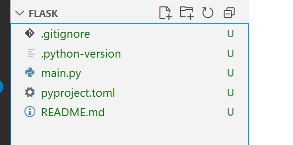
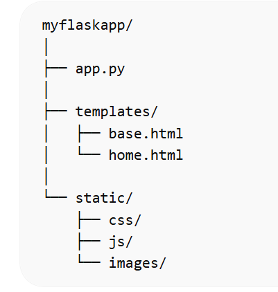

# Flask

https://flask.palletsprojects.com/en/stable/

| Feature                | CGI                                                       | WSGI                                                |
| ---------------------- | --------------------------------------------------------- | --------------------------------------------------- |
| **Process model**      | Starts a new process per request → slow for many requests | Persistent process → fast                           |
| **Language**           | Any executable language (Perl, Python, C, etc.)           | Python only                                         |
| **Standardization**    | Informal, server-dependent                                | Formal Python standard (PEP 3333)                   |
| **Performance**        | Low (forking process for every request)                   | High (server stays alive, can handle many requests) |
| **Ease of frameworks** | Harder to build complex apps                              | Many frameworks use WSGI (Flask, Django, FastAPI)   |


**Resumen**

- CGI = “la forma antigua”: el servidor ejecuta tu script cada vez que alguien visita la página. Funciona, pero es lento.

- WSGI = “la forma moderna en Python”: el servidor mantiene tu aplicación en memoria, llamándola para cada petición. Mucho más rápido y escalable.

**Analogía de ejemplo**

- CGI: Cada vez que alguien pide un café, contratas a un nuevo barista, haces el café y luego lo despides.

- WSGI: Tienes un barista de turno listo para servir a cualquier cantidad de clientes rápidamente.




## Gestor de paquetes - UV

uv es una herramienta de línea de comandos para administrar proyectos de Python, especialmente orientada a aplicaciones web con frameworks como Flask.

Permite crear proyectos, añadir dependencias, iniciar servidores de desarrollo y organizar apps de forma más estructurada.

Piensa en uv como un mini gestor de proyectos y entorno para web apps, similar a lo que npm init hace en Node.js, pero para Python.

## Flask app

```bash
py -m ensurepip --upgrade
py -m pip --version
```

Usar pip install para install uv de forma global.
```bash
py -m pip install uv
py -m uv --version 
```

Crear una nueva folder y ejecutar flask-app - no llamarlo flask, ya que se confunde

```bash
py -m uv init
py -m uv add flask
```

Crear el archivo *app.py*:

```python
from flask import Flask

app = Flask(__name__)

@app.route("/")
def home():
    return "Hello, Flask + uv is working!"

if __name__ == "__main__":
    app.run(debug=True)
```

```bash
py -m uv run python app.py
```

