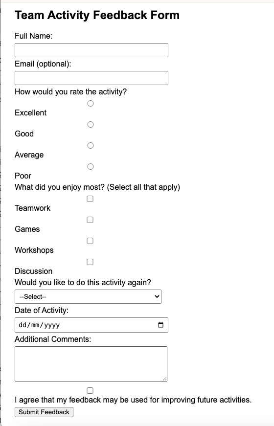

# Feedback del reto
Al final del reto, los profesores suelen preguntar por feedback. Hacer tu propio formulario para conseguir feedback del alumnado.



---


# Respuesta
```


<!DOCTYPE html>
<html lang="en">
<head>
<meta charset="UTF-8">
<meta name="viewport" content="width=device-width, initial-scale=1.0">
<title>Team Activity Feedback</title>
<style>
    body { font-family: Arial, sans-serif; padding: 20px; }
    .form-group { margin-bottom: 5px; }
    label { display: block; margin-bottom: 5px; }
    input, select, textarea { width: 300px; padding: 5px; }
</style>
<script>
function validateFeedback() {
    
    const name = document.getElementById("fullname").value;
    const agree = document.getElementById("agree").checked;

    // Name required
    if (name === "") {
        alert("Please enter your name.");
        return false;
    }


    alert("Thank you for your feedback!");
    return true;
}
</script>
</head>
<body>

<h2>Team Activity Feedback Form</h2>
<form name="feedbackForm" onsubmit="return validateFeedback()">

    <div class="form-group">
        <label for="fullname">Full Name:</label>
        <input type="text" name="fullname" id="fullname">
    </div>

    <div class="form-group">
        <label for="email">Email (optional):</label>
        <input type="email" name="email" id="email">
    </div>

    <div class="form-group">
        <label>How would you rate the activity?</label>
        <input type="radio" name="rating" value="excellent" id="rating-excellent">
        <label for="rating-excellent">Excellent</label>
        <input type="radio" name="rating" value="good" id="rating-good">
        <label for="rating-good">Good</label>
        <input type="radio" name="rating" value="average" id="rating-average">
        <label for="rating-average">Average</label>
        <input type="radio" name="rating" value="poor" id="rating-poor">
        <label for="rating-poor">Poor</label>
    </div>

    <div class="form-group">
        <label>What did you enjoy most? (Select all that apply)</label>
        <input type="checkbox" name="favoriteParts" value="teamwork" id="part-teamwork">
        <label for="part-teamwork">Teamwork</label>
        <input type="checkbox" name="favoriteParts" value="games" id="part-games">
        <label for="part-games">Games</label>
        <input type="checkbox" name="favoriteParts" value="workshops" id="part-workshops">
        <label for="part-workshops">Workshops</label>
        <input type="checkbox" name="favoriteParts" value="discussion" id="part-discussion">
        <label for="part-discussion">Discussion</label>
    </div>

    <div class="form-group">
        <label for="wouldRepeat">Would you like to do this activity again?</label>
        <select name="wouldRepeat" id="wouldRepeat">
            <option value="">--Select--</option>
            <option value="yes">Yes</option>
            <option value="maybe">Maybe</option>
            <option value="no">No</option>
        </select>
    </div>

    <div class="form-group">
        <label for="activityDate">Date of Activity:</label>
        <input type="date" name="activityDate" id="activityDate">
    </div>

    <div class="form-group">
        <label for="comments">Additional Comments:</label>
        <textarea name="comments" id="comments" rows="4"></textarea>
    </div>

    <div class="form-group">
        <input type="checkbox" name="agree" id="agree">
        <label for="agree">I agree that my feedback may be used for improving future activities.</label>
    </div>

    <button type="submit">Submit Feedback</button>
</form>

</body>
</html>
```