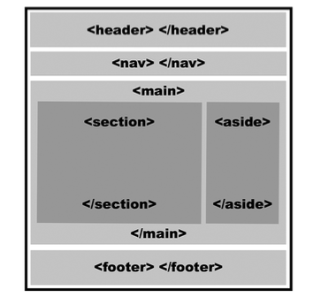
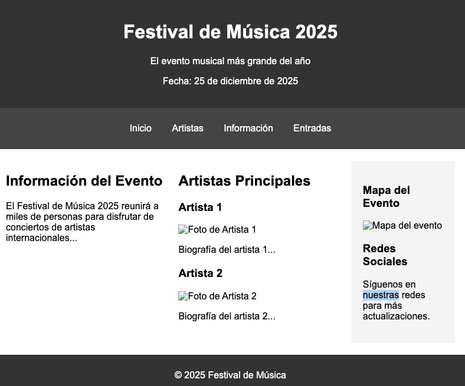

# Estructura

📝 Ventajas del uso de **etiquetas semánticas**

- Accesibilidad: lectores de pantalla pueden identificar mejor el contenido.

- SEO: Google y otros motores entienden mejor la estructura del sitio.

- Mantenimiento: el código es más claro y organizado.

- Compatibilidad futura: HTML5 está diseñado para ser semántico y duradero.


## `<main>`:
Representa el contenido principal de la página. Contiene la información central que es relevante para el propósito principal del documento y debe ser único por página.

## `<nav>`:
Se usa para definir una sección de navegación, que contiene enlaces a otras partes del sitio web o a otras páginas.

## `<section>`:
Define una sección del documento que tiene un tema o propósito común. Usualmente, se usa para agrupar contenido relacionado, como capítulos, artículos o secciones dentro de una página.

## `<aside>`:
Representa contenido relacionado, pero no central, con el tema principal de la página. A menudo se usa para barras laterales, citas o enlaces adicionales.

## `<article>`:
Representa contenido autónomo y autocontenido, como un artículo de un blog, una entrada de noticia o un comentario. Se puede reutilizar de manera independiente fuera del contexto original.

## `<header>`:
Define la cabecera de una página o sección. Generalmente incluye el logo, el título o los menús de navegación.

## `<footer>`:
Representa el pie de página de un documento o sección. Usualmente contiene información de contacto, derechos de autor, enlaces a políticas, etc.


## `<div>`:
No es una etiqueta semantica. Una etiqueta de contenedor genérica utilizada para agrupar elementos sin ningún significado semántico. Se usa para aplicar estilos o estructurar el contenido de manera flexible.



**Actividad 1:**



Usar la siguiente CSS para aplicar estilos
```css
   <style>
        /* Basic styling */
        body {
            font-family: Arial, sans-serif;
            margin: 0;
            padding: 0;
            display: flex;
            flex-direction: column;
            min-height: 100vh;
        }

        header {
            background-color: #333;
            color: white;
            padding: 20px;
            text-align: center;
        }

        nav {
            background-color: #444;
            color: white;
            padding: 10px;
            text-align: center;
        }

        nav ul {
            list-style: none;
            padding: 0;
        }

        nav ul li {
            display: inline;
            margin: 0 15px;
        }

        nav ul li a {
            color: white;
            text-decoration: none;
        }

        main {
            display: flex;
            flex: 1;
            padding: 20px;
        }

        section {
            flex: 2; /* Main content takes more space */
            margin-right: 20px;
        }

        aside {
            flex: 1; /* Sidebar takes less space */
            background-color: #f4f4f4;
            padding: 20px;
        }

        footer {
            background-color: #333;
            color: white;
            padding: 10px;
            text-align: center;
        }

        article {
            margin-bottom: 20px;
        }

        img {
            max-width: 100%;
            height: auto;
        }

    </style>
```
