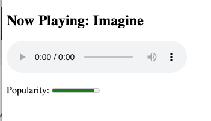
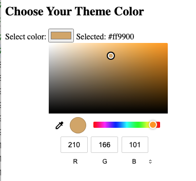
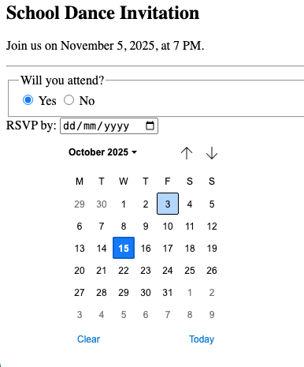
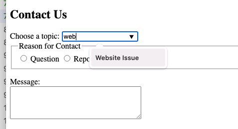

# Controles avanzados de HTML
Antes de empezar, repasar todos los controles de HTML avanzado o menos conocido, en:

[HTML Avanzado](7-html5-avanzado.html)

Aprovechar 5 minutos para saber un poco de la historia de HTML5,

[HTML5](https://es.wikipedia.org/wiki/HTML5)

Aprovechando los controles en 7-html.advanzado.html, crear una página web para hacer las actividades a continuación. El enfoque es HTML, no CSS. 

## Actividad 1
En esta actividad, estas combinando un audio playlist con un progreso etiqueta

## Actividad 2
En esta actividad, usar un input type color.

## Actividad 3
En esta actividad, usar input etiquetas para forms

## Actividad 4
En esta actividad, otra vez usamos un form. Pero esta vez, en lugar de usar un select option tag, usamos datalist que es más potente y visual.

---

# Respuestas

[Respuestas](7.1-html.advanced.respuesta.html)