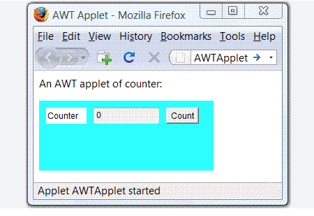

# Ayuda

[Java Contenido](https://maycolmo.github.io/pe/java.pdf)

# Instalacion
Son implementaciones de Open JDK (no hay diferencias en el código, sino en las licencias - Corretto is free para production)
- https://jdk.java.net/
- https://aws.amazon.com/es/corretto/

```bash
java -version
```

Java: Compile → Bytecode → JVM → JIT → Machine code
Python: Parse → Bytecode → Interpreter

Comandos para compilar y ejecutar:

```bash
javac HelloWorld.java       # compilar
java HelloWorld             # ejecutar

javap -c HelloWorld         # ver el bytecode
javap -c -verbose HelloWorld

# Bundle in a jar file:
jar cfe HelloWorld.jar HelloWorld HelloWorld.class

# c = create
# f = output file
# e = entry point (main class)


# y ejecutar con:
java -jar HelloWorld.jar

```

# Docker

Using openjdk:17-jdk-bullseye image as it has apt-get, so can install other required programs

Make sure in /java directory:

```bash
$ docker build -t java-dev .
```

Local directory is mounted to /workspace

```bash
$ docker run -it --name java-container \
    -v "$(pwd)":/workspace \
    -p 8080:8080 \
    java-dev
```


Create a new local file called HelloWorld.java:

```java
public class HelloWorld {
    public static void main(String[] args) {
        System.out.println("Hello, Docker Java!");
    }
}
```

In Docker container:
Compile it: $ javac HelloWorld.java
Run it: $ java HelloWorld

# Comparación
Java tiene una relación estrecha con C y C++:

**C**:
Dennis Ritchie at Bell Labs; 1972.

```c
#include <stdio.h>

int main() {
    printf("Hello World!\n");

    int a = 5;
    int b = 3;
    int sum = a + b;

    printf("The sum of %d and %d is %d\n", a, b, sum);

    return 0;
}
```

**C++**:
Bjarne Stroustrup at Bell Labs, 1985.
Agregar funcionalidad de objetos / clases (OOP) a C.

```c++
#include <iostream>
using namespace std;

int main() {
    cout << "Hello World!" << endl;

    int a = 5;
    int b = 3;
    int sum = a + b;

    cout << "The sum of " << a << " and " << b << " is " << sum << endl;

    return 0;
}
```

**Java**:
James Gosling and team at Sun Microsystems, 1995.

```java
public class Main {
    public static void main(String[] args) {
        System.out.println("Hello World!");

        int a = 5;
        int b = 3;
        int sum = a + b;

        System.out.println("The sum of " + a + " and " + b + " is " + sum);
    }
}

```

# Filosofia

“Simple, seguro, portable, orientado a objetos, robusto y con rendimiento razonable.”

- Escribir una vez, correr en cualquier lugar (“Write Once, Run Anywhere”)
- Seguridad antes que velocidad absoluta (Java fue pensado para aplicaciones de red y web, así que la seguridad era prioritaria.)
- Orientación a objetos desde el principio.
- Java no es un lenguaje para aprender: es un lenguaje para programadores profesionales


# Historia de Java

## Entre 1991 y 1995 – Nace Java en Sun Microsystems

Internet no fue el objetivo original de Java! La motivación principal, en cambio, fue la necesidad de un lenguaje que fuera independiente de la plataforma y que pudiera emplearse para crear un software que estuviera incrustado en varios dispositivos electrónicos para uso del consumidor, como tostadoras, hornos de microondas y controles remotos

Aunque el deseo de desarrollar un lenguaje de programación de arquitectura neutral constituyó la chispa inicial, Internet fue el que finalmente condujo al éxito de Java a gran escala.

Java es propietario


Sun controla JDK, JVM y bibliotecas


Se populariza por “write once, run anywhere”


2006 – Nace OpenJDK


Sun libera OpenJDK bajo licencia GPL + Classpath Exception


Open-source, gratuito y comunidad puede contribuir


Sun sigue vendiendo su JDK comercial


2009 – Oracle compra Sun


Oracle se convierte en dueño de Java y OpenJDK


Oracle JDK = versión comercial con soporte pagado


OpenJDK = implementación oficial, gratuita y abierta


2010s – Consolidación


OpenJDK se convierte en referencia oficial de Java SE


Oracle JDK y OpenJDK prácticamente idénticos en funcionalidades


Surgen otras distribuciones basadas en OpenJDK:


Amazon Corretto


Eclipse Temurin


Azul Zulu


2020s – Java hoy


OpenJDK = núcleo gratuito y abierto


Oracle JDK = versión con soporte empresarial pagado


Otros JDK (Corretto, Temurin, Zulu) ofrecen LTS gratuitos


Java sigue siendo multiplataforma y ampliamente usado


# ¿Qué es un applet en Java?



Un applet es un programa Java pequeño que estaba diseñado para ejecutarse dentro de un navegador web.

Es un tipo especial de clase que extiende java.applet.Applet (o javax.swing.JApplet en versiones más modernas).

No se ejecuta directamente desde la línea de comandos, sino dentro de un navegador o un visor de applets.

Tenía acceso limitado al sistema, por seguridad (sandbox). Sin embargo, algunos exploit permitían saltarse la sandbox, accediendo a archivos locales o al sistema.

**Los applets ya están obsoletos y no se usan en navegadores modernos, debido a problemas de seguridad y soporte.**

```java
import java.applet.Applet;
import java.awt.Graphics;

public class HolaApplet extends Applet {
    public void paint(Graphics g) {
        g.drawString("¡Hola, Applet!", 50, 50);
    }
}
```

```html
<applet code="HolaApplet.class" width="200" height="100"></applet>
```