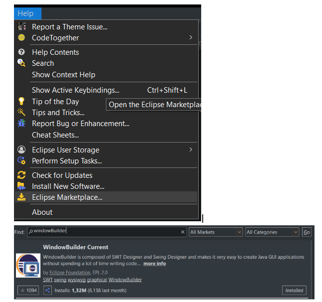
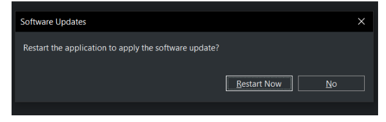
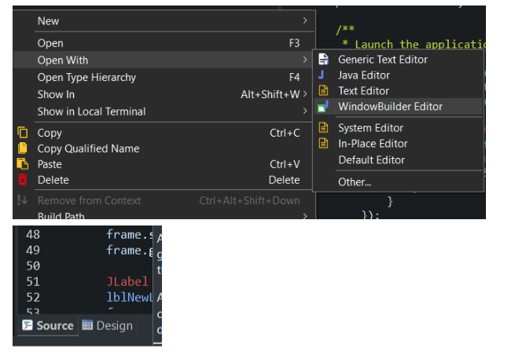
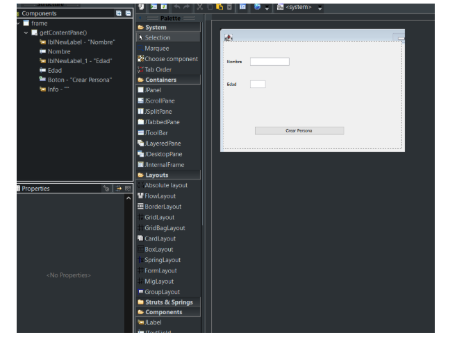

# Window Builder con Eclipse

Para usar windowBuilder en eclipse hay que descargarse la extensión e instalarla. Para eso hay que meterse en el eclipse marketplace en la pestaña Help (figura 1). Se busca windowBuilder en el buscador y se instala el WindowBuilder Current (figura 2). Hay que esperar que se descargue (puede tardar entre 2 y 5 mins). Cuando esté descargado habrá que clicar en Restart Now (Figura 3) . Cuando se haya descargado se abre el Swing con WindowBuilder Editor (figura 4). En la parte de abajo del código aparecerá la pestaña design (figura 5) y esta es la que nos va a ayudar a diseñar el JFrame (figura 6).

