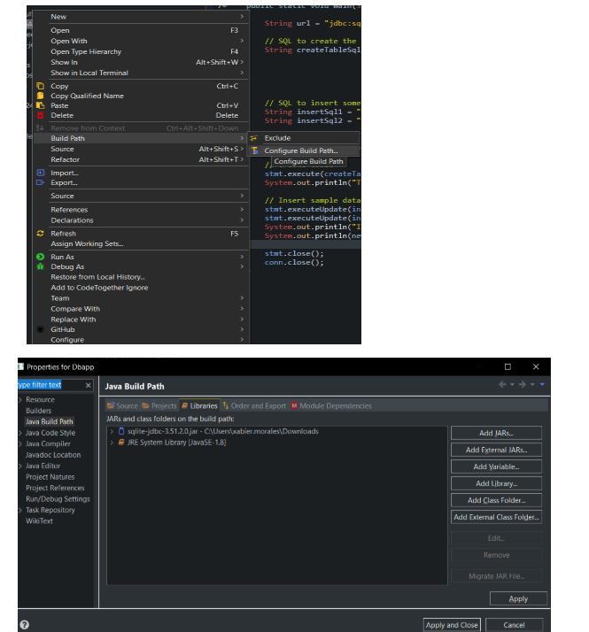
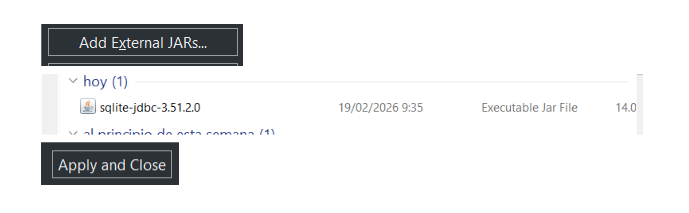

# Jars con Eclipse

Para añadir Jars a un proyecto en java, tenemos que meternos en la configuración del Build Path (figura 1). Una vez dentro, tenemos que acceder a libraries (figura 2). Aquí aparecerán las librerías que forman parte de nuestro proyecto, pudiendo añadir Jars externos (figura 3). Seleccionamos el Jar descargado y hacemos click en apply and close.

