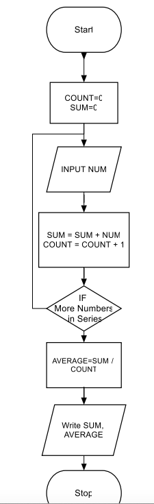
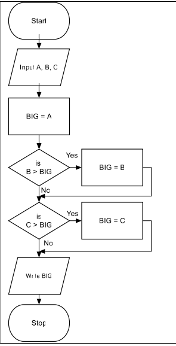

# Diagrama de Flujo
Un diagrama de flujo es una representación visual que muestra, paso a paso, la lógica de un programa o algoritmo. Utiliza símbolos estandarizados —como rectángulos para acciones, rombos para decisiones y flechas para el flujo— para describir cómo avanza un proceso desde el inicio hasta el final.

En programación, los diagramas de flujo siguen siendo muy útiles para:

- Planificar la lógica antes de escribir código.

- Explicar cómo funciona un algoritmo a otras personas.

- Detectar errores de diseño antes de implementarlo.

- Documentar procesos complejos en equipos de desarrollo.

Aunque hoy existen lenguajes de alto nivel y herramientas de depuración avanzadas, los diagramas de flujo siguen siendo una herramienta didáctica y práctica para razonar sobre la estructura de un programa.

Hoy conviven con **pseudocódigo**, **UML** y otras herramientas, pero siguen siendo una de las formas más intuitivas de visualizar la lógica de un programa.

[Más información](https://courses.minia.edu.eg/Attach/16036flowchart-algorithm-manual.pdf)

