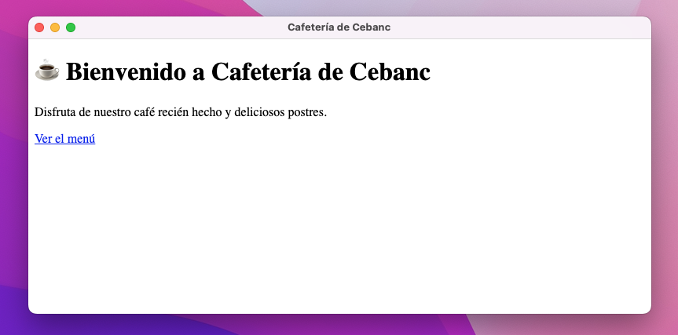
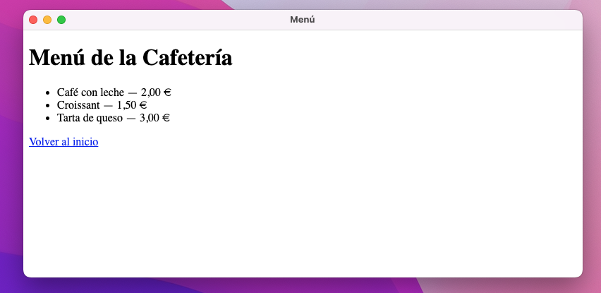
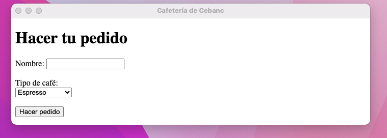
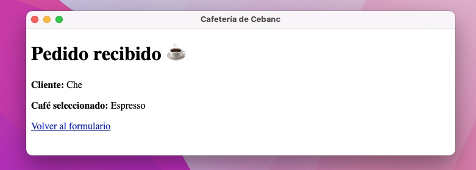
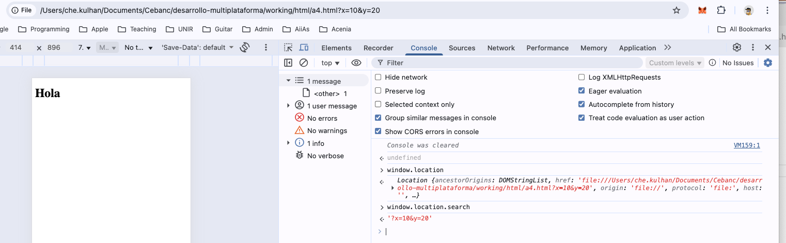

# Electron usando HTML

**Borrar lo que ya tenemos y empezar de nuevo, instalando electron, etc...!**

# Ejercicio: “Menú de cafetería con navegación básica”
## 🎯 Objetivo

Aprender a usar etiquetas `<a>` para navegar entre páginas locales en una aplicación Electron, simulando un pequeño menú digital de una cafetería.

## Descripción

Vas a crear una aplicación sencilla de escritorio para una cafetería.

- Inicio (index.html) — muestra el nombre de la cafetería y un enlace al menú.

- Menú (menu.html) — muestra algunos productos y un enlace para volver a inicio.

- Pedidos (pedidos.html) - un formulario GET para captar el pedido del cliente

- Resultado del pedido (confirm.html) - una página para mostrar el resultado del pedido.

Al hacer clic en los enlaces, la aplicación deberá cambiar de página dentro de la misma ventana de Electron.






## Ayuda

En la última página, tendremos que captar los datos que pasamos a través del querystring GET, para posteriormente mostrarles en la página. Usar Javascript y la clase URLSearchParams para colocar los valores en su ubicación de la página:



Usando Chrome Dev Tools, echar un vistazo a:
```javascipt
const x = new URLSearchParams(window.location.search);
```

Por ejemplo:

```javascript
<script>
    window.onload = () => {
      const params = new URLSearchParams(window.location.search);
      

      document.getE....textContent = ;
    };
  </script>
```
---


## Respuesta
```javascript
<script>
    window.onload = () => {
      const params = new URLSearchParams(window.location.search);
      const nombre = params.get('nombre') || '(no ingresado)';
      const cafe = params.get('cafe') || '(no seleccionado)';

      
      document.getElementById('nombre').textContent = nombre;
      document.getElementById('cafe').textContent = cafe;
    };
  </script>
```
