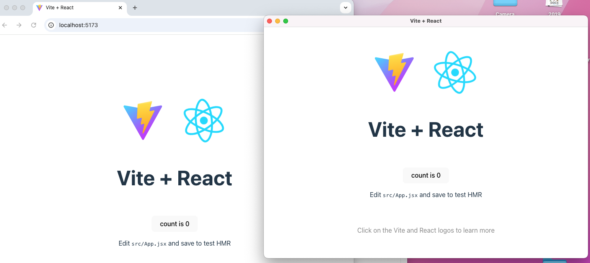

# Electron y React JS
Nuestro objetivo es configurar Electron para que integre el proyecto de React JS


```perl
my-electron-app/
│
├── main.js                # Electron main process (creates window, menu, etc.)
├── preload.js             # (optional) preload scripts for Electron
├── package.json           # Electron scripts & dependencies
├── node_modules/          # Electron dependencies
│
├── react-app/             # React + Vite project
│   ├── index.html
│   ├── package.json       # React scripts & dependencies
│   ├── vite.config.js
│   └── src/
│       ├── main.jsx       # React entry point
│       ├── App.jsx
│       └── components/   # Optional: your React components
│
└── dist/                  # (generated after building React for production)
```


## Instalaciones de Electron
En la carpeta de Electron, instalamos electron-is-dev
```bash
npm install electron-is-dev
```
## React JS

Dentro de la carpeta electron, vamos a crear una aplicación de React usando vite:

```bash
npm create vite@latest react-app -- --template react
cd react-app
npm install
npm run dev
```

Editar el package.js para build con vite (si hace falta):

```json
"scripts": {
  "dev": "vite",
  "build": "vite build"
}
```

## Ajustar Electron para cargar ReactJS
Modificar el main.js para cargar ReactJS en lugar de index.html

```js
import { app, BrowserWindow } from 'electron';
import path from 'path';
import isDev from 'electron-is-dev'; // optional, to distinguish dev vs build

const createWindow = () => {
  const win = new BrowserWindow({
    width: 800,
    height: 600,
    webPreferences: {
      nodeIntegration: true,
      contextIsolation: false
    }
  });

  const startURL = isDev
    ? 'http://localhost:5173' // Vite dev server
    : `file://${path.join(__dirname, 'react-app/dist/index.html')}`;

  win.loadURL(startURL);
}

app.whenReady().then(createWindow);
```


## Start
Ejecutar los 2 proyectos en diferentes consolas:

ReactJS - acceder desde http://localhost:5173/
```bash
 npm run dev
```

Electron
```bash
 npm run dev
```