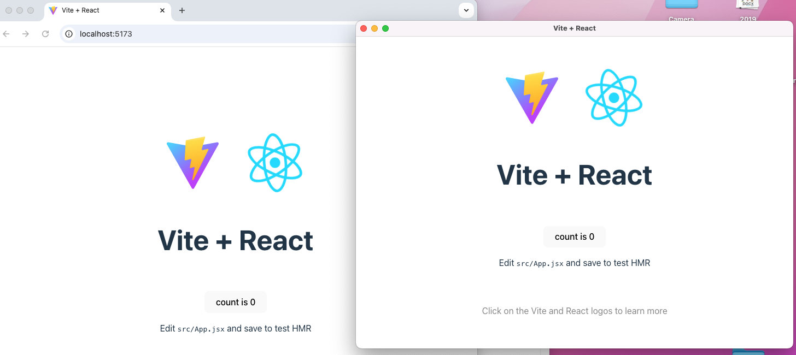

# Electron y React JS
Nuestro objetivo es configurar Electron para que integre el proyecto de React JS


```perl
my-electron-app/
│
├── main.js                # Electron main process (creates window, menu, etc.)
├── preload.js             # (optional) preload scripts for Electron
├── package.json           # Electron scripts & dependencies
├── node_modules/          # Electron dependencies
│
├── react-app/             # React + Vite project
│   ├── index.html
│   ├── package.json       # React scripts & dependencies
│   ├── vite.config.js
│   └── src/
│       ├── main.jsx       # React entry point
│       ├── App.jsx
│       └── components/   # Optional: your React components
│
└── dist/                  # (generated after building React for production)
```


## Instalaciones de Electron
En la carpeta de Electron, instalamos electron-is-dev
```bash
npm install electron-is-dev
```
## React JS

Dentro de la carpeta electron, vamos a crear una aplicación de React usando vite:

```bash
npm create vite@latest react-app -- --template react
cd react-app
npm install
npm run dev
```

Editar el package.js para build con vite (si hace falta):

```json
"scripts": {
  "dev": "vite",
  "build": "vite build"
}
```

## Ajustar Electron para cargar ReactJS
Modificar el main.js para cargar ReactJS en lugar de index.html

```js
import { app, BrowserWindow } from 'electron';
import path from 'path';
import isDev from 'electron-is-dev'; // optional, to distinguish dev vs build

const createWindow = () => {
  const win = new BrowserWindow({
    width: 800,
    height: 600,
    webPreferences: {
      nodeIntegration: true,
      contextIsolation: false
    }
  });

  const startURL = isDev
    ? 'http://localhost:5173' // Vite dev server
    : `file://${path.join(__dirname, 'react-app/dist/index.html')}`;

  win.loadURL(startURL);
}

app.whenReady().then(createWindow);
```


## Start
Ejecutar los 2 proyectos en diferentes consolas:

ReactJS - acceder desde http://localhost:5173/
```bash
 npm run dev
```

Electron
```bash
 npm run dev
```


# Menu en ReactJS

De momento, no sabemos como crear rutas en ReactJS, pero lo veremos en el futuro. Para ahora, incluimos la página web principal (servidor de ReactJS) a través de win.loadURL('http://localhost:5173/');

```js

import {app, BrowserWindow, Menu} from 'electron';

let win;

const createWindow = () => {
    win = new BrowserWindow({
        height:700,
        width:700,
    });

    win.loadURL('http://localhost:5173/');

    win.webContents.openDevTools();

}


app.whenReady().then(() => {

    createWindow();

    const template = [
    {
      label: 'Navigate',
      submenu: [
        {
          label: 'Home',
          click: () => {
            win.loadURL('http://localhost:5173/');
          },
        },
        {
          label: 'About',
          click: () => {
            win.loadURL('http://localhost:5173/#/aboutus');
          },
        },
      ],
    },
  ];

  const menu = Menu.buildFromTemplate(template);
  Menu.setApplicationMenu(menu);

});

```

# Rutas en Electron

- BrowserRouter necesita un servidor web para manejar rutas como /aboutus.

- En Electron, muchas veces no hay servidor (carga desde file://), así que esas rutas fallan.

- HashRouter usa #/aboutus, que React interpreta solo en el navegador y funciona sin servidor.

Así, los enlaces y menús de Electron funcionan siempre, tanto en desarrollo como en producción.

🔹 Cómo usarlo

En React:
```
import { HashRouter as Router } from 'react-router-dom';
```

En Electron:
```
win.loadURL('http://localhost:5173/#/aboutus'); // desarrollo
win.loadFile('dist/index.html', { hash: 'aboutus' }); // producción
```

Eso lo atacaremos de nuevo en 03-componentes-visuales/reactjs/02-routes-params


# Javascript Conceptos Avanzados en ReactJS (opcional)

Antes de pasar a ReactJS, vamos a practicar Javascript en el navegador, ya que hay algunos constructs que usanmos bastante en ReactJS, muchas veces sin darnos cuenta.

- Arrow Functions

- Map:
```js


const numbers = [1, 2, 3];

numbers.map((num, i) => {
    console.log(`x is ${num} y el index is ${i}`);
});


const doubled = numbers.map(n => n * 2);
console.log(doubled); // [2, 4, 6]
```

- Investigar el uso de filter y find, ya que funcionan como lo de map.