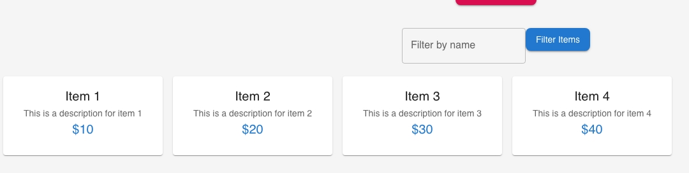
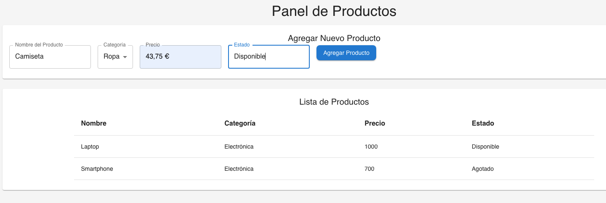

# Material Design
https://m3.material.io/

El sistema de diseño Material Design, creado por Google en 2014, surge con el objetivo de ofrecer un lenguaje visual unificado para aplicaciones web, móviles y de escritorio. Se apoya en la metáfora del “material” (como papel y tinta) para dotar de profundidad, luz, sombra y movimiento a las interfaces digitales — facilitando que los usuarios entiendan qué es interactivo, qué cambia, y cómo. 

Su razón de ser es doble: por un lado, mejorar la usabilidad y accesibilidad mediante componentes reutilizables, movimientos coherentes e interfaces adaptables a distintas plataformas; por otro, acelerar el desarrollo y asegurar la coherencia del lenguaje visual a través de un sistema completo de directrices, diseños modulares y personalizables. 

En cuanto a la competencia, los principales sistemas de diseño que han surgido o evolucionado en paralelo son:

- Human Interface Guidelines (HIG) de Apple, centrado en la simplicidad, el realismo sutil y la coherencia en iOS y macOS.

- Fluent Design System de Microsoft, que apuesta por la luz, la profundidad y la transparencia en Windows y productos de Microsoft.

- Carbon Design System de IBM, y Atlassian Design System, usados más en entornos corporativos.

Estos sistemas compiten en ofrecer consistencia visual, componentes reutilizables y experiencias accesibles, pero cada uno refleja la filosofía de diseño y ecosistema tecnológico de su compañía.

---

Varios aspectos importantes que conviene destacar más allá del estilo visual o los componentes:

1. Diseño centrado en el usuario (UX):
Material Design no es solo un conjunto de reglas gráficas; está pensado para guiar el comportamiento y la interacción. Se basa en principios psicológicos como la retroalimentación inmediata, la jerarquía visual clara, y la consistencia para que el usuario se sienta orientado y seguro en la interfaz.

2. Escalabilidad y coherencia:
Un punto clave es que permite crear sistemas de diseño escalables, donde distintas aplicaciones y equipos pueden mantener una identidad visual y de interacción coherente. Esto es esencial en entornos corporativos o productos grandes con múltiples módulos.

3. Adaptabilidad y responsividad:
Material Design propone cómo las interfaces deben adaptarse a distintos tamaños de pantalla, dispositivos y contextos. Esto lo hace ideal para desarrollar aplicaciones web y móviles con un comportamiento fluido y predecible.

4. Accesibilidad (A11y):
El sistema incluye pautas para cumplir estándares de accesibilidad, como contraste de color, tamaño de texto, y compatibilidad con lectores de pantalla. Esto no solo es ético, sino también una práctica profesional esencial en el desarrollo moderno.

5. Motion design (animaciones funcionales):
Las animaciones en Material Design no son decorativas: refuerzan la comprensión del usuario sobre lo que ocurre en la interfaz (por ejemplo, un botón que se expande al abrir un diálogo o un icono que rota al actualizar).

6. Tematización y personalización:
Material 3 (M3) introduce Material You, un enfoque que permite personalizar colores y estilos dinámicamente según las preferencias del usuario o la marca, integrando tecnología de extracción de color del entorno o del fondo del dispositivo.

7. Ecosistema de implementación:
Además de MUI (para React), existen implementaciones en Flutter, Angular, y web nativa (con Material Web Components), lo que demuestra su relevancia transversal en el desarrollo moderno.

## MUI with reactjs
https://mui.com/

*Material Design* define el lenguaje visual y las reglas (colores, sombras, tipografía, interacción, movimiento), mientras que *MUI* proporciona el código listo para usar —botones, menús, formularios, layouts— siguiendo esas reglas. Así, los desarrolladores pueden construir aplicaciones web que mantengan la apariencia y experiencia de Material Design sin tener que diseñar todo desde cero.

**Instalacion y configuracion**
https://mui.com/material-ui/getting-started/installation/

Roboto font es la fuente por defecto:

```bash
npm install @mui/material @emotion/react @emotion/styled
npm install @fontsource/roboto
npm install @mui/icons-material
```

Ejemplo Component:

```jsx
import * as React from 'react';
import Button from '@mui/material/Button';

export default function ButtonUsage() {
  return <Button variant="contained">Hello world</Button>;
}
```


https://mui.com/material-ui/all-components/


# Themes
https://mui.com/material-ui/customization/theming/?srsltid=AfmBOoqLcIMqnsRbcrgRVKrogr5npCsiUdz5UqQnIXgueuTU-PjBP8jq

Theme creador: https://zenoo.github.io/mui-theme-creator/

NOTAS: Por ejemplo:
- ensuring consistency across different browsers
- Without `<CssBaseline />`, text rendering might look slightly different across browsers.
- In Chrome, `<body>` has an 8px margin by default, whereas other browsers may have different values. 

**Paso 1:** Crear un theme

Crear un archivo theme.js en el directorio donde esta App.js:

```jsx
import { createTheme } from "@mui/material/styles";

const theme = createTheme({
  palette: {
    primary: {
      main: "#1976d2", // Blue
    },
    secondary: {
      main: "#dc004e", // Pink
    },
    background: {
      default: "#f5f5f5", // Light gray background
      paper: "#ffffff",
    },
  },
  typography: {
    fontFamily: "'Roboto', sans-serif",
    h1: {
      fontSize: "2rem",
      fontWeight: 600,
    },
    body1: {
      fontSize: "1rem",
    },
  },
  components: {
    MuiButton: {
      styleOverrides: {
        root: {
          borderRadius: "8px",
          textTransform: "none",
        },
      },
    },
  },
});

export default theme;
```

**Paso 2:** Wrap your app with the ThemeProvider en index.js

```jsx
import React from 'react';
import ReactDOM from 'react-dom/client';
import './index.css';
import App from './App.js';
import { ThemeProvider } from "@mui/material/styles";
import CssBaseline from "@mui/material/CssBaseline";
import theme from "./theme.js"; 

const root = ReactDOM.createRoot(document.getElementById('root'));
root.render(
  <React.StrictMode>
   <ThemeProvider theme={theme}>
      <CssBaseline /> 
      <App />
    </ThemeProvider>
  </React.StrictMode>
);


export default App;
```


Para acceder el Theme en un componente:

```jsx
import React from "react";
import { useTheme } from "@mui/material/styles"; // importar el Hook para usar el theme
import { Button, Typography, Box } from "@mui/material";

const ThemedComponent = () => {
  const theme = useTheme(); // Access the theme

  return (
    <Box
      sx={{
        backgroundColor: theme.palette.background.default,
        padding: theme.spacing(2),
        borderRadius: theme.shape.borderRadius,
      }}
    >
      <Typography variant="h4" color={theme.palette.primary.main}>
        Themed Component
      </Typography>
      <Button variant="contained" color="secondary">
        Themed Button
      </Button>
    </Box>
  );
};

export default ThemedComponent;
```

## Actividad 1

Empezar con un listado de items:

```javascript
const items = [
  { id: 1, name: 'Item 1', description: 'This is a description for item 1', price: '$10' },
  { id: 2, name: 'Item 2', description: 'This is a description for item 2', price: '$20' },
  { id: 3, name: 'Item 3', description: 'This is a description for item 3', price: '$30' },
  { id: 4, name: 'Item 4', description: 'This is a description for item 4', price: '$40' },
];
```

Recordar:

- Aplicar un map para mostrar cada elemento de Card (cambiar items por filteredItems)
```jsx
{items.map(item => (
    <Card key={item.id} sx={{ width: 250 }}>
```

Ejecutar la funcion handleFilter para filtrar los items en el button:

```jsx
<Button onClick={handleFilter} variant="contained" sx={{ marginBottom: '20px' }}>
  Filter Items
</Button>
```



## Actividad 2 Productos Dashboard

import { Grid, Card, CardContent, Typography, TextField, Button, Table, TableBody, TableCell, TableContainer, TableHead, TableRow, Snackbar, Box, ListItem, ListItemText, List, InputLabel, FormControl, Select, MenuItem } from "@mui/material";


