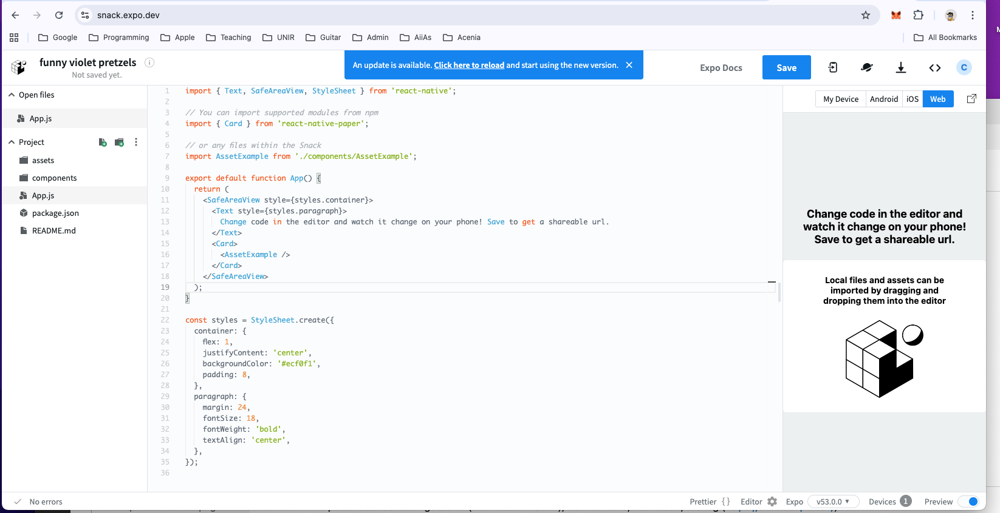
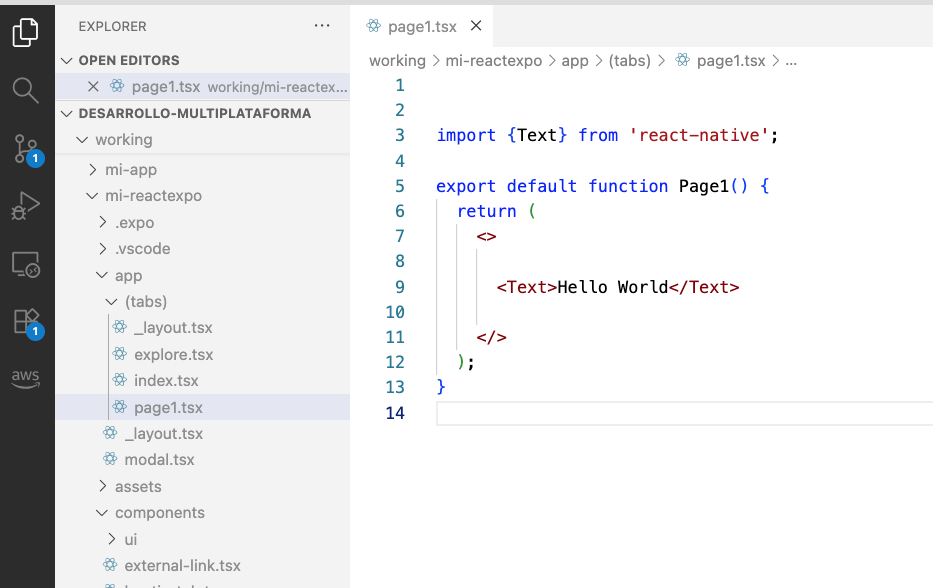

# Timeline de React Native

2011-2013: Facebook desarrolla React para web, con componentes declarativos y Virtual DOM.

2013-2015: Idea de llevar React a apps móviles, evitando escribir código nativo separado para iOS y Android.

2015: Lanzamiento oficial de React Native como proyecto open-source.

Facebook Ads Manager es una de las primeras apps grandes.

2016-2018: Popularización: adopción en startups y empresas como Instagram, Airbnb, Bloomberg.

Se introducen herramientas como hot reloading.

2018-2020: Consolidación del ecosistema: librerías de navegación, animaciones, y Expo para desarrollo rápido.

2020-2023: Mejoras de rendimiento: Fabric Renderer, JSI, soporte para Hermes.

Hoy: React Native es una plataforma madura para desarrollo multiplataforma, con un ecosistema robusto y aplicaciones grandes en producción.

# Configuracion
- Expo: ofrece facil configuracion (no Xvoe o Android), built-in API's, hot reload, testing (https://snack.expo.dev/)
- React Native CLI


Mi herramienta favorita para aprender:




# Expo
Vamos a configurar un proyecto de Expo local:

```bash
npx create-expo-app <nombre_del_proyecto>
cd <nombre_del_proyecto>
npx expo start
```





