# Accesibilidad

[Definición](https://www.w3.org/WAI/)

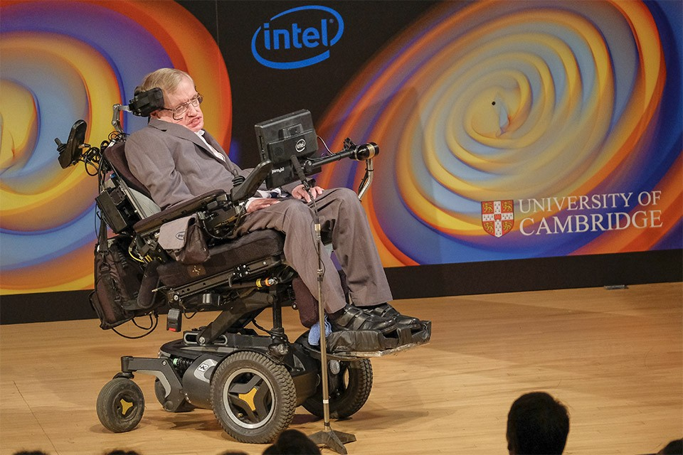

La accesibilidad web abarca todas las discapacidades que afectan el acceso a la Web, incluidas:

- auditivo
- cognitivo
- neurológico
- físico
- discurso
- visual

La accesibilidad web también beneficia a las personas sin discapacidad, por ejemplo:

- Personas que utilizan teléfonos móviles, relojes inteligentes, televisores inteligentes y otros dispositivos con pantallas pequeñas, diferentes modos de entrada, etc.
- Personas mayores con capacidades cambiantes debido al envejecimiento.
personas con “discapacidades temporales”, como un brazo roto o la pérdida de gafas
- Personas con “limitaciones situacionales”, como por ejemplo, en condiciones de luz solar intensa o en un entorno donde no pueden escuchar audio.
- Personas que utilizan una conexión a Internet lenta o que tienen un ancho de banda limitado o costoso.

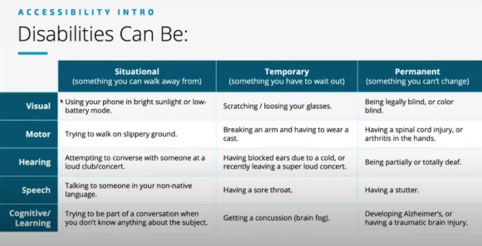

https://www.youtube.com/watch?v=0X31SgzSdIU (pasar por los diapositivos)

https://www.w3.org/WAI/videos/standards-and-benefits/es  (subtitulos en castellano)

## Actividades de introduccion
- [Pedir una cita](https://www.dgtcitaprevia.es/cita-previa-dgt-murcia/)
- [Comprar un product](http://www.pnwx.com)
- [Registrarse](https://sede.educacion.gob.es/informacion-ayuda/registro-electronico.html)
- [Rellenar el formulario](http://udacity.github.io/ud891/lesson3-semantics-built-in/02-chromevox-lite/)
- [Intenta rellenar este formulario sin usar el raton](http://udacity.github.io/ud891/lesson2-focus/01-basic-form/)

## Accesibilidad en contexto

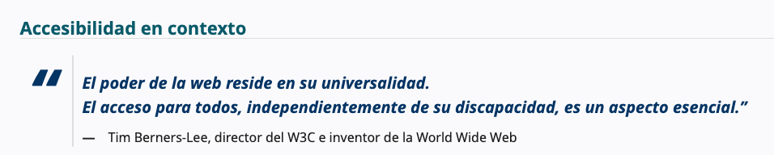

**A11y** es una abreviatura de "accessibility" (accesibilidad en inglés). Se utiliza para referirse a la accesibilidad web o a la accesibilidad en general en el contexto de la tecnología. El número 11 en el término "A11y" representa la cantidad de letras que se omiten entre la "A" y la "Y" en la palabra "accessibility", lo cual lo convierte en una forma corta y fácil de recordar.
Pronunciar
- "A eleven y"
- "A-one-one-y"
- "A once i"

La Web está diseñada fundamentalmente para funcionar para todas las personas, independientemente de su hardware, software, idioma, ubicación o capacidad. Cuando la Web cumple este objetivo, es accesible para personas con diversas capacidades auditivas, motoras, visuales y cognitivas.

Por lo tanto, el impacto de la discapacidad en la web cambia radicalmente, ya que esta elimina las barreras de comunicación e interacción que muchas personas enfrentan en el mundo físico. Sin embargo, cuando los sitios web, las aplicaciones, las tecnologías o las herramientas están mal diseñados, pueden crear barreras que impiden el uso de la web.

La accesibilidad es esencial para los desarrolladores y las organizaciones que desean crear sitios web y herramientas web de alta calidad y no excluir a las personas del uso de sus productos y servicios.

¿Qué es la accesibilidad web?
Accesibilidad web significa que los sitios web, las herramientas y las tecnologías están diseñados y desarrollados para que las personas con discapacidad puedan usarlos. Más específicamente, las personas pueden:

- Percibir, comprender, navegar e interactuar con la Web
- contribuir a la Web

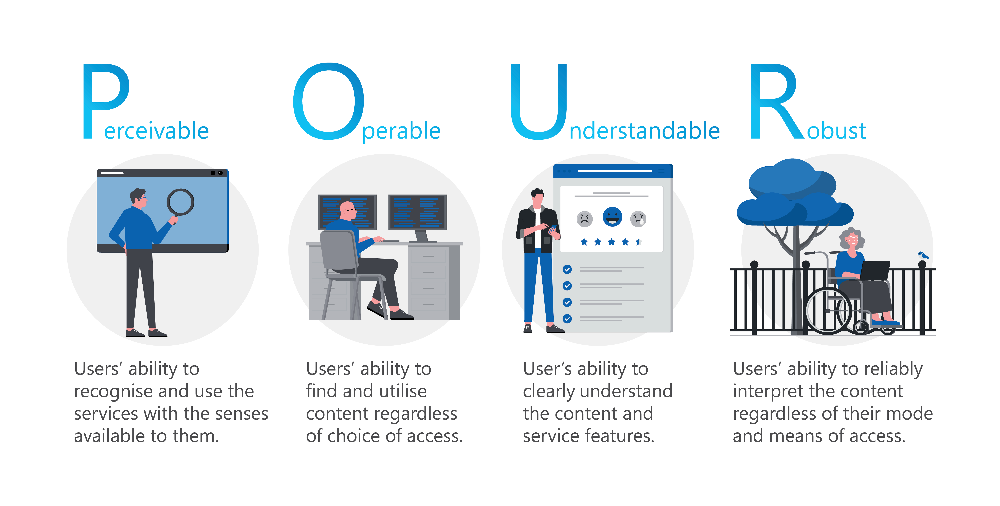

## Principios fundamentales
Los principios fundamentales de las Pautas de Accesibilidad para el Contenido Web (WCAG) se basan en cuatro conceptos clave, que sirven como la base para hacer que los sitios web sean accesibles para personas con diversas discapacidades. Estos principios son:

1. Perceptible (Perceivable)
El contenido debe ser presentado de tal manera que los usuarios puedan percibirlo a través de uno o más de sus sentidos (vista, audición, etc.). Si un contenido no es percibido, no puede ser comprendido o utilizado.

Ejemplos de pautas bajo este principio:

- Texto alternativo: Las imágenes deben tener un texto alternativo adecuado (alt) para que las personas con discapacidad visual puedan entenderlas a través de un lector de pantalla.
- Contraste: El texto debe tener suficiente contraste con el fondo para garantizar que las personas con baja visión puedan leerlo.
- Subtítulos y transcripciones: Videos deben tener subtítulos o transcripciones para las personas con discapacidad auditiva.

2. Operable (Operable)
El contenido debe ser operable, es decir, los usuarios deben poder interactuar con él de manera efectiva. Esto implica que los usuarios puedan acceder y controlar los elementos interactivos de la página, como enlaces, formularios y botones.

Ejemplos de pautas bajo este principio:

- Navegación con teclado: Los usuarios deben poder navegar por todo el contenido utilizando solo el teclado (sin necesidad de mouse).
- Tiempo suficiente: Los usuarios deben tener suficiente tiempo para leer y operar el contenido, como en formularios o tareas que requieran tiempo.
- Evitar contenido que se mueva rápidamente: Se debe evitar el uso de elementos que se muevan demasiado rápido o de manera inesperada (por ejemplo, animaciones que causen mareos).

3. Comprensible (Understandable)
El contenido debe ser comprensible tanto en su presentación como en su funcionamiento. Los usuarios deben ser capaces de comprender el contenido de la página y cómo interactuar con él.

Ejemplos de pautas bajo este principio:

- Lenguaje claro: El lenguaje debe ser claro y sencillo para que sea comprensible para todos los usuarios, incluidos los que tienen discapacidades cognitivas.
- Predecibilidad: Los elementos interactivos deben comportarse de manera predecible. Por ejemplo, los botones deben hacer lo que el usuario espera que hagan.
- Ayuda para formularios: Los formularios deben tener etiquetas claras y instrucciones para facilitar su uso, especialmente para personas con discapacidades cognitivas.

4. Robusto (Robust)
El contenido debe ser lo suficientemente robusto para que pueda ser interpretado de manera fiable por una amplia variedad de tecnologías, incluidas las futuras tecnologías asistivas.

Ejemplos de pautas bajo este principio:

- Compatibilidad con tecnologías asistivas: El contenido debe ser compatible con diversas tecnologías asistivas como lectores de pantalla, braille, etc.
- Uso de estándares web: El contenido debe seguir estándares web bien establecidos (por ejemplo, HTML, CSS, ARIA) para asegurar la máxima compatibilidad con diferentes dispositivos y tecnologías asistivas.

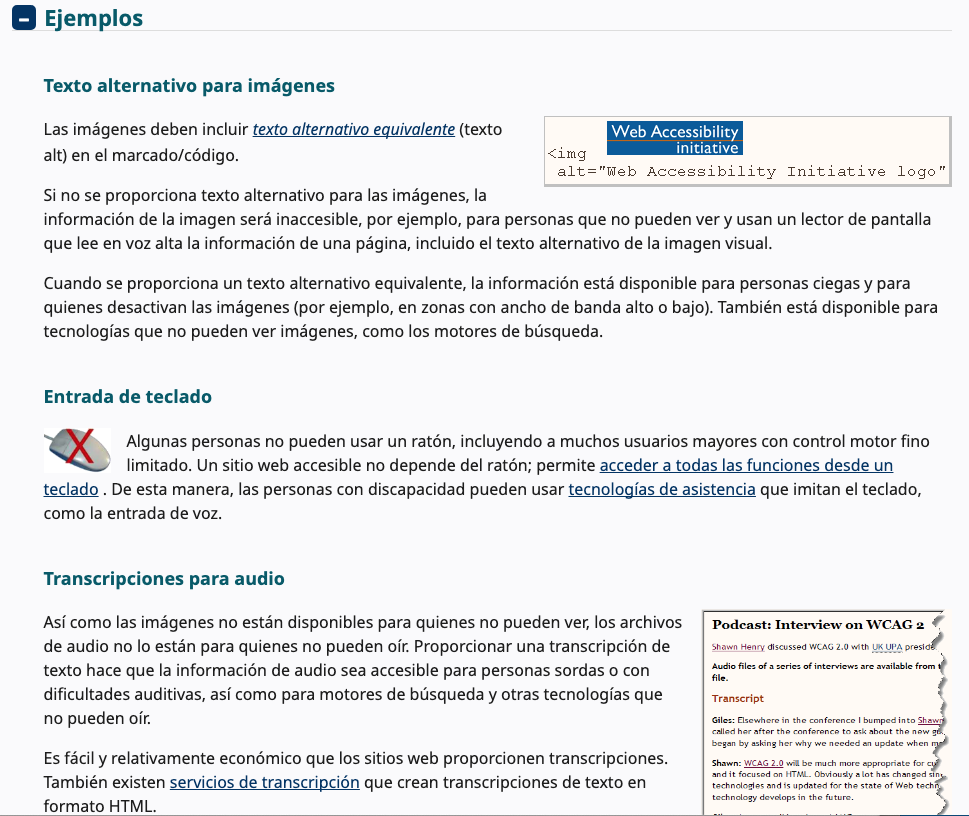

Ejemplos de páginas:
- https://www.gov.uk/
- https://webaim.org/

## Nivels de conformidad
Las Pautas de Accesibilidad para el Contenido Web (WCAG) definen criterios específicos para hacer que los sitios web sean accesibles para personas con discapacidades. Estas pautas se dividen en tres niveles de conformidad: A, AA, y AAA. Cada nivel indica la importancia de las pautas que se deben cumplir.

1. Nivel A (El mínimo)
Descripción: El nivel A cubre los criterios más esenciales para la accesibilidad de un sitio web. Si una página no cumple con los requisitos de este nivel, no es accesible para muchos usuarios y no debe considerarse accesible.
Impacto: La falta de conformidad en este nivel puede hacer que algunas personas no puedan acceder a contenidos básicos en el sitio web. Estos criterios abordan barreras importantes que deben eliminarse para que el contenido sea mínimamente usable.

**Ejemplos de pautas de nivel A:**
- Texto alternativo para imágenes: Es obligatorio proporcionar un texto alternativo (alt) para las imágenes, para que las personas que no pueden verlas (como las personas ciegas) sepan qué contienen.
- Accesibilidad mediante teclado: El sitio debe ser navegable únicamente con el teclado, sin necesidad de un ratón, para personas con discapacidad motriz.

2. Nivel AA (Recomendado para la mayoría de los sitios)
Descripción: El nivel AA cubre los criterios que hacen que el sitio sea accesible para una mayor parte de la población. Estos criterios son importantes para mejorar la usabilidad general y asegurar que la mayoría de los usuarios, independientemente de sus discapacidades, puedan navegar por el sitio.
Impacto: Si una página no cumple con este nivel, se crea una barrera significativa para algunas personas, lo que afecta su capacidad para usar el sitio de manera efectiva.

**Ejemplos de pautas de nivel AA:**
- Contraste de colores: Asegurarse de que el contraste entre el texto y el fondo sea lo suficientemente alto, de modo que las personas con baja visión o deficiencias de color puedan leer el texto fácilmente.
- Navegación clara y consistente: Los elementos de navegación, como los menús y botones, deben ser consistentes a lo largo del sitio para facilitar su uso.
- Formulario accesible: Los formularios deben tener etiquetas asociadas (con el atributo label en HTML) para ayudar a los usuarios con discapacidad visual a completar correctamente los campos.

3. Nivel AAA (Accesibilidad completa)
Descripción: El nivel AAA es el nivel más alto de accesibilidad. Cubrir todos los criterios de este nivel asegura que el sitio sea accesible para la mayor cantidad de usuarios posible, incluidas personas con discapacidades graves o múltiples.
Impacto: Los criterios de nivel AAA son muy específicos y cubren situaciones muy particulares. Es posible que no todos los sitios web necesiten cumplir con todos los criterios de este nivel, pero siempre se debe intentar mejorar la accesibilidad a este nivel cuando sea posible.

**Ejemplos de pautas de nivel AAA:**
- Contenidos traducidos o subtitulados: Proporcionar subtítulos y/o descripciones en audio para los contenidos multimedia para que las personas con discapacidades auditivas o cognitivas puedan comprenderlos.
- Contenidos adaptables: Permitir que los usuarios puedan personalizar la presentación del contenido (como el tamaño de la fuente) sin perder funcionalidad.

## ¿Qué hacer para que tu web sea accesible?

- [Principios](https://www.w3.org/WAI/fundamentals/accessibility-principles/) 
- [Easy checks](https://www.w3.org/WAI/test-evaluate/easy-checks/)
- [Tips, Pistas](https://www.w3.org/WAI/tips/)

## Demo - accesibilidad101.demo.html
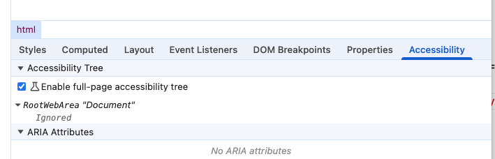

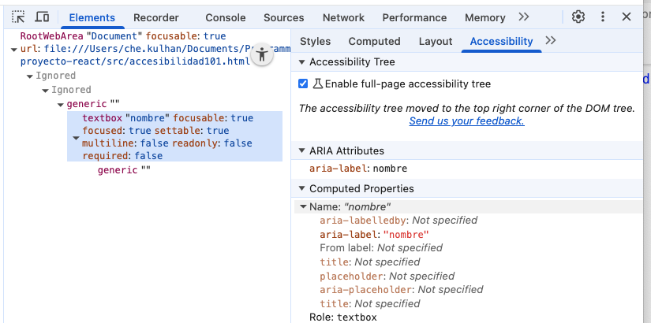

**Contraste de colores**
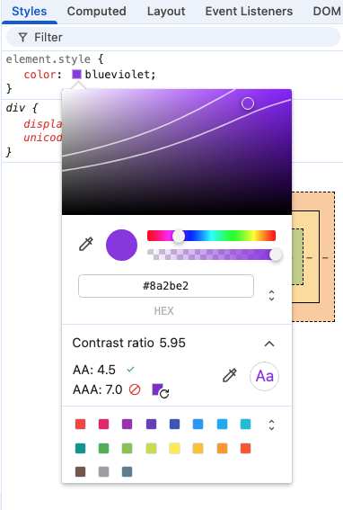

**Vision deficiencias**
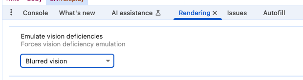

## Actividades

## Actividad Intro:
- Google Docs: Escribir por voz
- Narrador
- Tutoriales:
    - https://web.dev/learn/accessibility

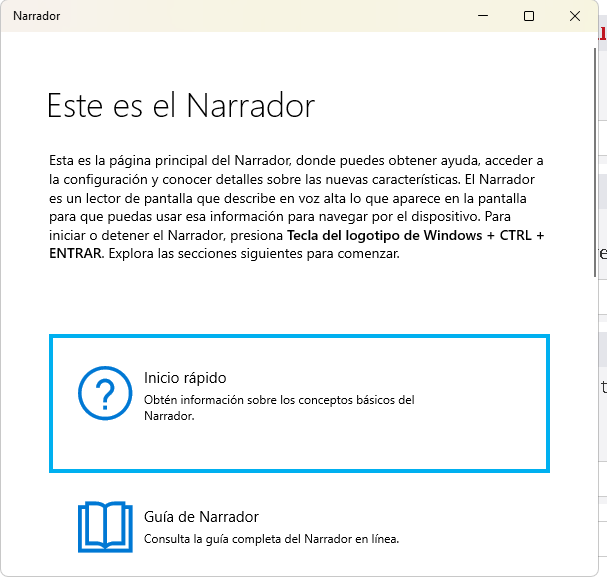

## Actividad:
Accesibilidad Actividad - hay que convertir el HTML en ReactJS aplicando técnicas de accesibilidad

## Actividad - hardware y software
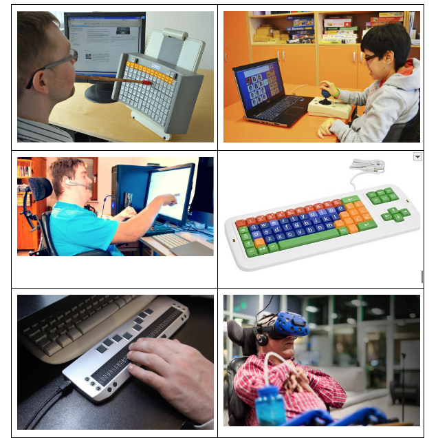
Echar un vistazo a estos recursos y comentarlo con tu compañero/a:

- https://es.slideshare.net/slideshow/tecnologa-asistiva-para-el-aprendizaje/62541484
- https://es.tobiidynavox.com/pages/products

[Windows Speech Recognition] (https://support.microsoft.com/en-us/windows/use-voice-recognition-in-windows-83ff75bd-63eb-0b6c-18d4-6fae94050571)

[Web Speech API](https://www.google.com/intl/es_es/chrome/demos/speech.html)

### Actividad 1 - Verificación facíl
Usando una página web tuyo (proyecto), pasar por el guia e implementar las sugerencias:

https://www.w3.org/WAI/test-evaluate/easy-checks/

### Actividad 2 - WCAG Guia
[Guia](https://www.w3.org/WAI/WCAG22/quickref/?versions=2.1)

## Actividad 3 - Markup validation service
https://validator.w3.org/

## Actividad 4 - extensiones y otras herramientas
- [WAVE](https://chromewebstore.google.com/detail/wave-evaluation-tool/jbbplnpkjmmeebjpijfedlgcdilocofh)
- [Ciego](https://chromewebstore.google.com/detail/lets-get-color-blind/bkdgdianpkfahpkmphgehigalpighjck)
- [Screen Reader](https://chromewebstore.google.com/detail/screen-reader-for-google/nddfhonnmhcldcbmhbdldfpkbfpgjoeh)
-[Verificar contraste fondos](https://webaim.org/resources/contrastchecker/)
-[Verificar contraste vinculos](https://webaim.org/resources/linkcontrastchecker/)
- [Google Lighthouse](https://chromewebstore.google.com/detail/lighthouse/blipmdconlkpinefehnmjammfjpmpbjk?hl=es)

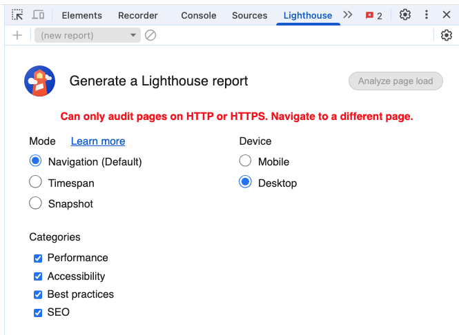

https://developer.chrome.com/docs/lighthouse/overview?hl=es-419

## Actividad - ley (TO DO)

Imagínate que has conseguido un contrato para desarrollar una página web para el Gobierno local. Buscar en el BOE información sobre “accesibilidad”. Comentar 5 cosas de importancia a tu compañero.

[BOE](https://www.boe.es/buscar/act.php?id=BOE-A-2023-7417)

## Actividad - Web Speech API
TO DO, using React create a page to input speech
https://www.google.com/intl/es_es/chrome/demos/speech.html

## Referencias
[Guia de Mozilla](https://developer.mozilla.org/es/docs/Web/Accessibility)

[Accesibilidad Cheat Sheets](https://moritzglantz.de/accessibility-cheatsheet/)

[Accesibilidad Cheat Sheets](https://learntheweb.courses/topics/accessibility-cheat-sheet/)

[Ejemplos](https://www.dbswebsite.com/blog/ada-compliance-starts-with-accessible-design/)

https://www.youtube.com/watch?v=2oiBKSjOOFE&t=91s