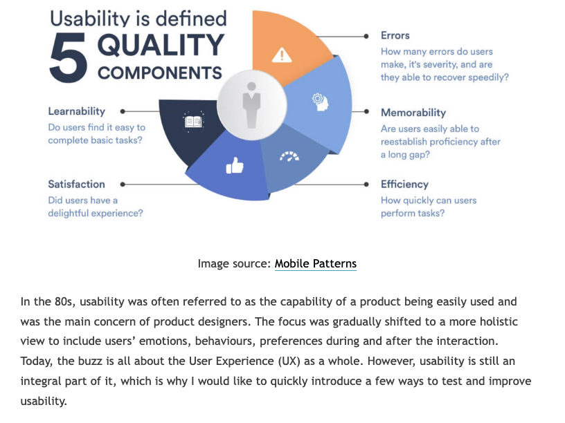

# Usabilidad
Es necesario que el proceso de usabilidad deba llevarse a cabo durante todo el proceso de desarrollo de un sistema o producto, de esta forma se obtienen beneficios como: 
- la reducción de costos de mantenimiento
- la reducción de los costos de uso
- la mejora en la calidad del producto 

5 E's de Usabilidad

https://www.youtube.com/watch?v=YkF8zVIZzXE

O dicho de otra forma (Jakob Nielson):
- Facilidad de aprendizaje (learnability) - fácil de aprender
- Eficiencia (efficiency) - una vez que saben usarlo - simple
- Memorabilidad (easy to remember) - fácil de recordar
- Tolerante a los errores
- Satisfacción (y emoción) - agradable

**The 5 Es of Usability**

- Effective – Can users achieve their goals accurately and completely?

- Efficient – Can they do it quickly, with minimal wasted effort or steps?

- Engaging – Is the experience pleasant, intuitive, and motivating?

- Error-tolerant – Does the system prevent errors, or help users recover easily?

- Easy to learn – Can new users quickly understand and start using it without frustration?

# Conceptos básicos y pautas
- Los 10 principios heurísticos de la usabilidad de Jakob Nielsen
- Diseñado para el mercado específico (target market)
    - Cuál es el objetivo fundamental de tu sitio web - e.g comprar un producto
- Cumplir estándares (HTML, CSS, accesibilidad, navegadores …)
- Herramientas de navegación (facilidad)
- Funcionalidad para buscar o ser buscado
- Contenido
    - Actual, cambiante, priorizar información importante
    - Enlace rotos
- Ley de 3 clicks - el usuario puede encontrar la información en 3 clicks
- Imagenes / video / multimedia para apoyar el contenido
- Diseño
    - Coherente, de calidad
    - Tipografía adecuada
    - Colores
        - Adobe colour wheel
- Rapidez en cargar la página
    - “Speed Update” - factor de algoritmo de Google Search
- Multi dispositivo
- Tener en cuenta las redes sociales (registración)

## Minimalista
Ejemplos:
- https://www.awwwards.com/websites/minimal/
- https://www.a2hosting.com/blog/minimalist-web-designs/
### Pautas
- Espacio en blanco = espacio negativo
- Colores que contraste
- Experimentar con las fuentes - https://fonts.google.com/
- Dividir el contenido de texto en bloques
- Usar navegación oculto
- Seleccionar imágenes - calidad
- KISS - Keep It Simple Stupid = una cosa solo a la vez para mantener la atención

### MUI
Introduccion a MUI - Usar el 02-MinimalistPage.jsx

# Evaluación de la Usabilidad
- Prototipos (en papel)
- Evaluación heurística, la metodología más utilizada en UX para medir la usabilidad de una interfaz. “consiste en examinar la calidad de uso de una interfaz por parte de varios evaluadores expertos, a partir del cumplimiento de unos principios reconocidos de usabilidad: los heurísticos” de Jakob Nielsen.
- Thinking aloud - se pide a los usuarios y de forma individual que expresen en voz alta y libremente sus pensamientos, sentimientos y opiniones sobre cualquier aspecto (diseño, funcionalidad…) mientras que interaccionan con el sistema o un prototipo.
- Recorrido Cognitivo o walkthrough (en fase tempranos sobre un prototipo)
- Grabar usuarios
- Eye tracking software (F-shaped lectura)
- Web analíticas - datos en tiempo real
- Grupos de enfoque
- Cuestionarios y entrevistas

## Diseño Centrado en el Usuario (DCU) - User Centered Design

El Diseño Centrado en el Usuario o DCU (UDC, User-Centered Design) hace referencia a una visión o filosofía del diseño en la que el proceso está conducido por información acerca de la audiencia objetiva del producto.

El Diseño Web Centrado en el Usuario se caracteriza porque todo el proceso de diseño y desarrollo de un sitio web debe estar conducido por el usuario, sus necesidades, sus características y objetivos.

Centrar el diseño en sus posibles usuarios (público objetivo) implica involucrar desde el comienzo a los usuarios en el proceso de desarrollo del sitio; conocer cómo son, qué necesitan, para qué usan el sitio; testar el sitio con los propios usuarios; investigar cómo reaccionan ante el diseño, cómo es su experiencia de uso; e innovar siempre con el objetivo claro de mejorar la experiencia del usuario.

La principal diferencia del DCU frente a otros enfoques es que su proceso no es secuencial o lineal, sino que presenta ciclos en los que iterativamente se prueba el diseño y se optimiza hasta alcanzar el nivel de calidad requerido.

Herramientas:
- User Personas: https://xtensio.com/user-persona-template/ o canva

- Protipos: 
    - https://proto.io/
    - https://www.fluidui.com/
    - Python streamlit

## User Persona para un chatbot
Basado en la user persona, vamos a crear un chatbot de voiceflow.com

Nombre: Sarah
Edad: 29 años
Ubicación: Nueva York, EE. UU.
Ocupación: Profesional de marketing

**Objetivos:**

Compra rápida: Sarah quiere encontrar y comprar ropa de forma rápida, sin perder tiempo navegando por múltiples categorías.

Recomendaciones personalizadas: Sarah está buscando nuevas tendencias de moda, pero no tiene mucho tiempo para explorar. Le gustaría recibir recomendaciones rápidas basadas en su estilo o en sus compras pasadas.

Resolución de problemas: Si tiene problemas con su pedido, como cambios de talla o problemas con el envío, quiere solucionarlos sin tener que llamar a un número de soporte.

**Puntos de Dolor:**

Esperas largas en atención al cliente: Se frustra si tiene que esperar mucho tiempo para obtener una respuesta, especialmente si el problema es simple.

Navegación confusa: Se siente perdida cuando la página no es intuitiva o las categorías de productos están mal organizadas.

**Comportamiento:**
Nivel de Habilidad Tecnológica: Sarah es experta en tecnología y usa aplicaciones de compras online de manera frecuente. Está acostumbrada a interactuar con chatbots, pero espera que sean eficientes.

Estilo de Comunicación Preferido: Le gusta que el chatbot sea amigable pero conciso. No tiene tiempo para charlas innecesarias, pero aprecia un tono relajado y útil.

Frecuencia de Uso: Usa el chatbot de ModaExpress varias veces por semana, tanto para hacer compras rápidas como para consultar el estado de sus pedidos o encontrar productos nuevos.

## Actividad de clase 

Para este proyecto, creará un prototipo de una aplicación móvil para ayudar a un compañero de clase a aprender algo nuevo. Entrevistar a un compañero de clase e identificar una barrera para su aprendizaje. El primer paso será identificar las preguntas e.g. ¿Qué cosa nueva querías aprender y por qué?

Deberá crear un prototipo de una aplicación que los ayude a superar esta barrera. Siéntase libre de probar nuevos enfoques creativos para el problema que ha identificado, pero sea lo que sea que decida diseñar, asegúrese de empatizar con las necesidades de su usuario. 

Con la ayuda de un compañero, se llevará a cabo una entrevista, una prueba con el fin de conseguir feedback o retroalimentación. OJO: Para hacer la prueba, hay que pensar cómo lo vas a llevar a cabo y cómo vas a presentar los resultados.

## Recursos
- http://blog.intelligenia.com/2018/01/experiencia-usuario-conceptos.html
- http://blog.intelligenia.com/2018/01/experiencia-usuario-conceptos2.html

- https://ocw.unican.es/pluginfile.php/1682/course/section/1190/Tema%208.%20Usabilidad%20Web.pdf

- https://color.adobe.com/create/color-wheel

