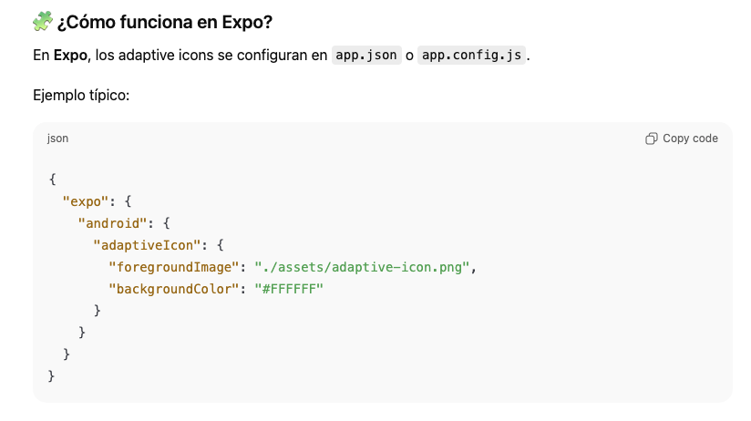

# Google Playstore

https://developer.android.com/distribute/marketing-tools

https://support.google.com/googleplay/android-developer/topic/3450987?hl=en&ref_topic=7072031&sjid=2825757958362170874-EU

Gestión de etiquetas (categorias y tags), descripciones cortas y largas, assets, privacidad, ...

## Descripciones

La descripción corta en Google Play es de hasta 80 caracteres (espacios incluidos).

Descripción larga: Hasta 4.000 caracteres

**Plantilla**

Frase inicial clara y directa (qué problema resuelve la app).

FUNCIONES PRINCIPALES
• Función 1
• Función 2
• Función 3

PARA QUIÉN ES
• Tipo de usuario
• Casos de uso

POR QUÉ USAR ESTA APP
• Beneficio clave
• Diferenciador

IDIOMAS
Disponible en español, inglés y euskera.

## App Icon y Splash Screen

📱 ¿Qué son los Adaptive Icons de Android?

Los Adaptive Icons son el formato moderno de iconos que usa Android desde Android 8 (Oreo).

En lugar de usar una sola imagen, Android usa dos capas:

- Capa de fondo (background)

- Capa frontal (foreground) → tu logo o símbolo

Android combina estas dos capas y adapta la forma del icono automáticamente según el dispositivo.

Herramientas:

- Android Asset Studio 
- https://www.figma.com/community/file/1466490409418563617 (Figma)

## Feature Graphics and Promo Video

https://www.apptamin.com/blog/feature-graphic-play-store/

