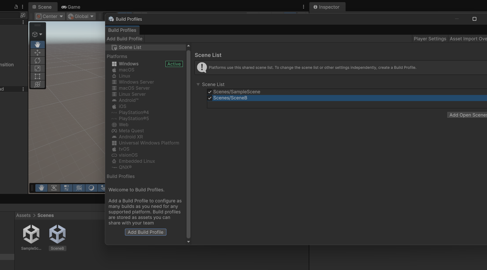

# Objectivo: Pinchar en un boton y se abre el Scene B en un juego 3D

Pasos: 
- Agregar un SceneA y en SceneB en un proyecto de 3D
- Agregar un empty object: SceneController. El código abajo se enlaza con el componente
- Agregar 3d Button component, modificando el texto del text (Fijate que añade un Canvas=>Button=>Text)
- En el evento de OnClick() del Buton, drag el SceneController y selecciona la funcion LoadSceneB
- Al final, en el proyecto Build Profile (File), agregar el SceneB a la lista, dragging el escenario


```csharp

using UnityEngine;
using UnityEngine.SceneManagement;

public class SceneController : MonoBehaviour
{
    public void LoadSceneB()
    {
        Debug.Log("Firing scene change");
        SceneManager.LoadScene("SceneB");
    }
}
```


