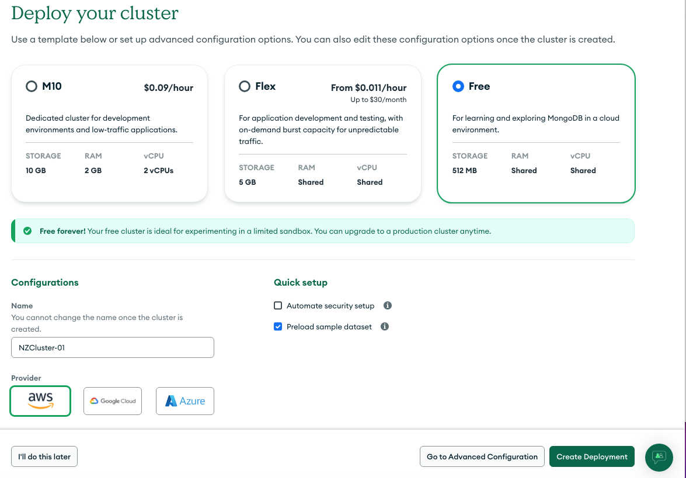
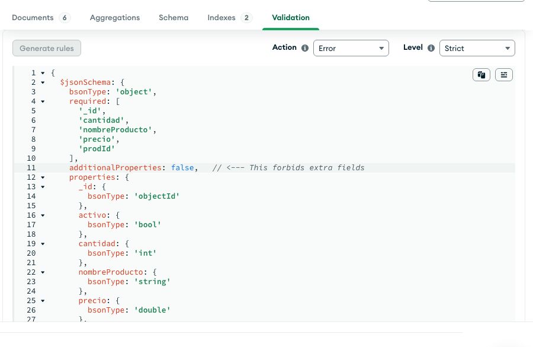
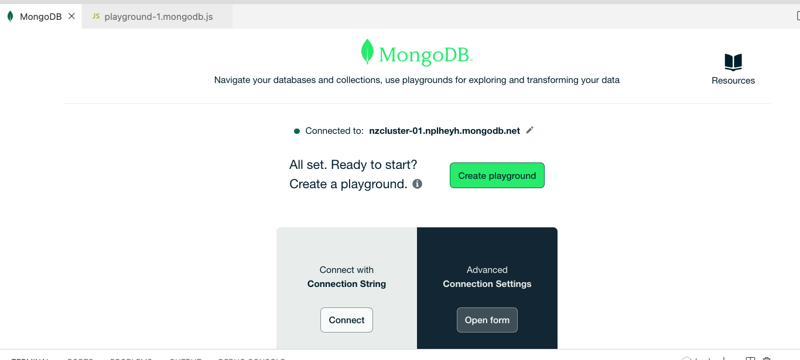
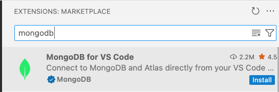
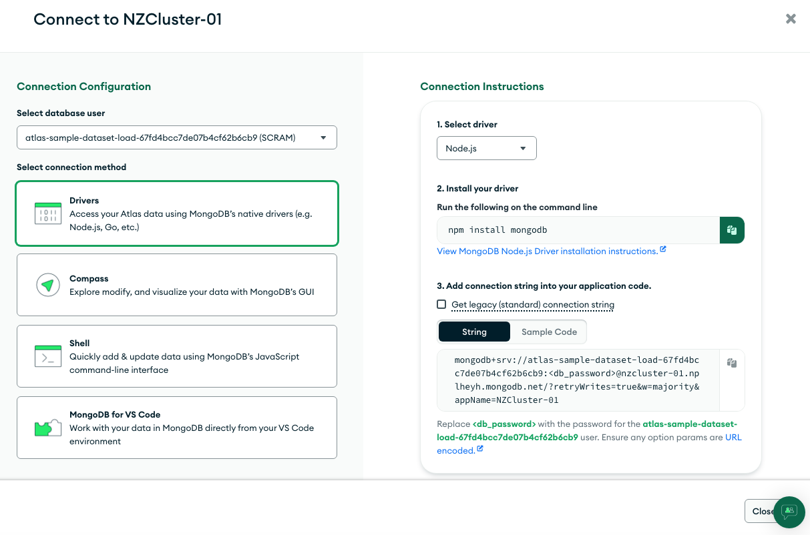

# Data Centers
https://aws.amazon.com/compliance/data-center/data-centers/

https://www.youtube.com/watch?v=4V91Bx8UzCw&t=318s (para casa)

# MongoDB

https://www.youtube.com/watch?v=-bt_y4Loofg

# Configuración del Clúster

Al configurar, incluir: 
- Incluir datos de ejemplo
- IP desde anywhere




mongodb, mongodb


## Gestinados colecciones

```json
[
  { "prodId": 100, "nombreProducto": "Camiseta", "precio": 20.99, "cantidad": 125 },
  { "prodId": 101, "nombreProducto": "Pantalón", "precio": 10.50, "cantidad": 234 },
  { "prodId": 102, "nombreProducto": "Chaqueta", "precio": 15.75, "cantidad": 432 },
  { "prodId": 103, "nombreProducto": "Zapatos", "precio": 17.30, "cantidad": 320 }
]
```

Ejecutamos unas consultas (queries) con la interfaz de Atlas.

```json
{"nombreProducto": "Camiseta"}
{"precio": 20.99}
{"precio": {$gt: 10}}
```

## Indices

Al ejecutar este consulta, ¿se usa un índice?
```json
{ "nombreProducto" : "Chaqueta"}
```

## Esquemas

Después de aplicar un esquema STRICT, ¿qué ocurre al insertar nuevos documentos?


```json

  { "prodId": 103, "nombreProducto": 126215214241, "precio": 17.30, "cantidad": 320 }
  
  { "prodId": 103, "nuevoAtributo": "abc", "nombreProducto": "Mi Producto", "precio": 17.30, "cantidad": 320 }
```




# Actividades
## Altas - consultas

Copiar este documento de personas en una colección nueva:

```json
[
   {
      "name": "Andrea Le",
      "email": "andrea_le@fake-mail.com",
      "school": {
         "name": "Northwestern"
      },
      "version": 5,
      "scores": [ 85, 95, 75 ],
      "dateCreated": { "$date": "2003-03-26" }
   },
   {
      "email": "no_name@fake-mail.com",
      "version": 4,
      "scores": [ 90, 90, 70 ],
      "dateCreated": { "$date": "2001-04-15" }
   },
   {
      "name": "Greg Powell",
      "email": "greg_powell@fake-mail.com",
      "version": 1,
      "scores": [ 65, 75, 80 ],
      "dateCreated": { "$date": "1999-02-10" }
   }
]
```

Teacher notas: https://www.mongodb.com/docs/compass/current/query/filter/

# MongoDB Playground

Guardar los archivos con extension '*.mongodb.js'.




# Consultas con MongoDB




## Ids y ObjectId
En MongoDB, cada documento dentro de una colección tiene un campo especial llamado _id, que se utiliza para identificar de manera única ese documento.

El campo _id siempre está presente en cada documento.

Si no se proporciona explícitamente al insertar un documento, MongoDB crea automáticamente un valor único para el campo _id.

Este identificador único es crucial porque MongoDB lo usa como clave primaria para cada documento en la base de datos.


**Estructura de un ObjectId:**
Un ObjectId es un identificador único de 12 bytes (96 bits), que generalmente se representa en formato hexadecimal de 24 caracteres.

Los 12 bytes del ObjectId se dividen en las siguientes partes:

- 4 bytes: Representan el timestamp (hora en que se creó el ObjectId) en segundos. Esto permite que los ObjectIds generados más tarde sean mayores, lo que facilita la ordenación cronológica.

- 5 bytes: Representan el ID de la máquina que generó el ObjectId (para garantizar que los ObjectId sean únicos en diferentes máquinas).

- 2 bytes: Representan el ID del proceso que creó el ObjectId (esto asegura que diferentes procesos en la misma máquina no generen el mismo ObjectId).

- 3 bytes: Un contador aleatorio que se incrementa con cada ObjectId generado por el proceso. Esto asegura la unicidad incluso si los otros componentes son idénticos.

Ejemplo de un ObjectId:
```json
"_id": ObjectId("5a9427648b0beebeb6957a4b")
```
Este ObjectId es único a nivel mundial y está compuesto por los 12 bytes mencionados anteriormente. Si bien no es completamente legible, permite que los documentos sean identificados de manera eficiente y ordenada.

Si insertas un documento sin especificar un valor para _id, MongoDB automáticamente creará un ObjectId para ese campo

**Excluir _id en consultas**
Cuando realizas consultas en MongoDB, puedes utilizar el campo _id para encontrar un documento específico. Ejemplo de consulta para obtener un documento por su ObjectId:

```js
db.users.findOne({ _id: ObjectId("605c72ef1532073e007f8d9b") })
```

Supongamos que tienes una colección llamada comments, y quieres obtener los campos name y text, pero sin incluir el campo _id en el resultado.

```js
db.comments.find(
  { name: "Gregor Clegane" },  // Filtro
  { _id: 0, name: 1, text: 1 }  // Proyección: Excluye `_id`, incluye `name` y `text`
)

// Mas ejemplos
use('clase');

db.productos.insertOne({
    prodId: 656,
    nombreProducto: "Desde VS Code",
    precio: 111,
    cantidad: 120
});

/* Sacar:
- los productos con pocas cantidades en stock, por ejemplo < 10
- mostrar el nombre y cantidad solamente del 'Chaqueta'
- mostrar productos con el precio > 20 AND (y) cantidad > 100
- mostrar el primer producto en la coleccion, usando ObjectId

*/
// Qué hacen estos comandos
use('clase');

// expresiones regulares
db.productos.find({nombreProducto: /apa/i})
db.productos.find({nombreProducto: /^C/})

db.productos.updateOne(
   { _id: ObjectId('68347b7c4ae331876deb9648')},
   {$set : {cantidad: 20} }
)

db.productos.deleteOne({nombreProducto: "Desde VS Code"});


db.productos.deleteOne({nombreProducto: "Desde VS Code"});


```

## Fechas


```js
db.comments.findOne(
    {date: 
        {$gt: ISODate('2015-02-08T00:00:00Z')} 
    })
```

## Sandbox (Indexes)
https://search-playground.mongodb.com/tools/code-sandbox/snapshots/new


# Programando con VSCODE 


