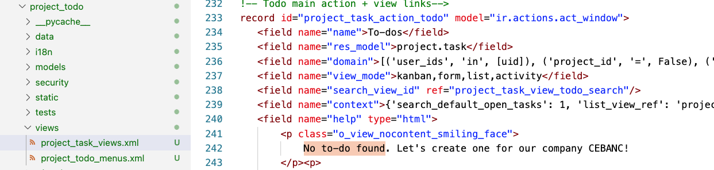
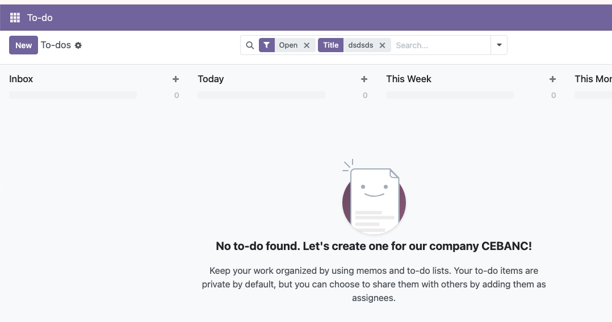
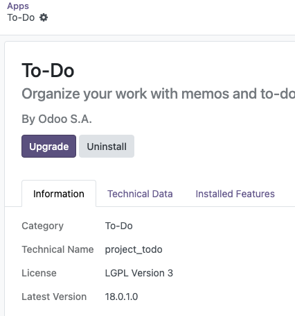
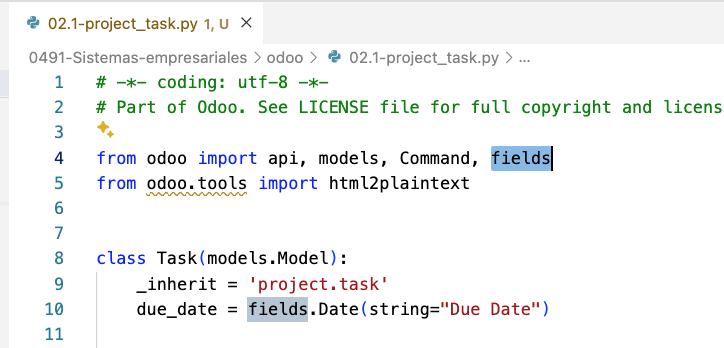
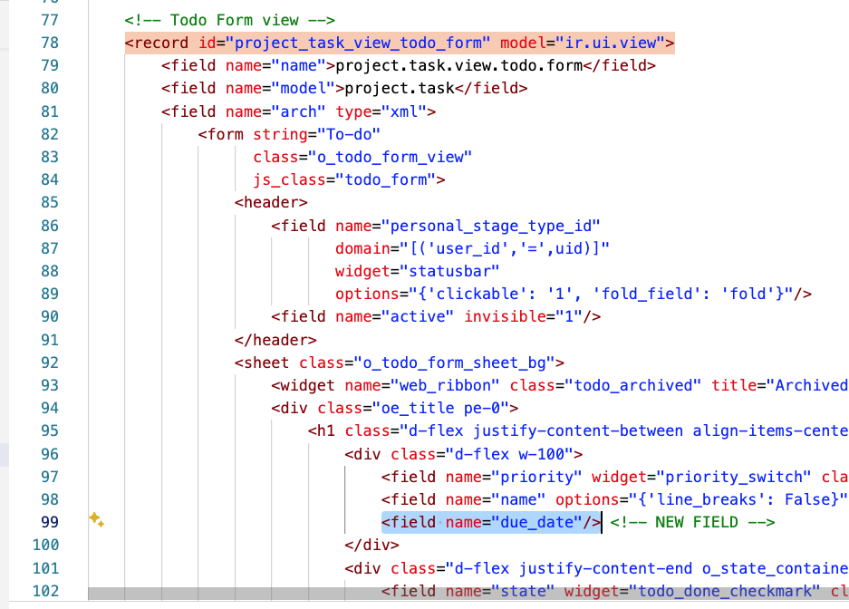
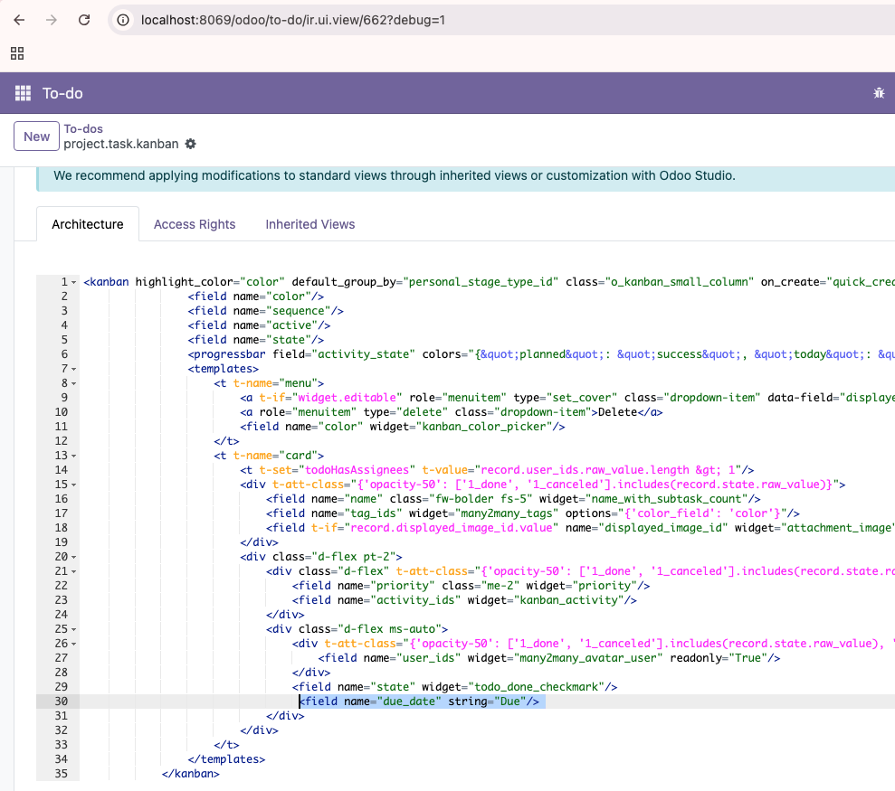

Entramos en el contenedor de Odoo y vemos los módulos:

```bash
docker exec -it odoo bash
cd /usr/lib/python3/dist-packages/odoo/addons
```

El project_todo es la aplicación de TO DO. Podemos realizar una copiar en local:

```bash
docker cp odoo:/usr/lib/python3/dist-packages/odoo/addons/project_todo ./project_todo
```
Y después de realizar unos cambios, copiamos los archivos que han sido modificados. 

Por ejemplo, modificamos el texto al ejecutar una búsqueda en TO DO



```bash
docker cp ./project_todo/views/project_task_views.xml  odoo:/usr/lib/python3/dist-packages/odoo/add
ons/project_todo/views/project_task_views.xml
```



Recordar que tenemos que actualizar el módulo para que se vea reflejados los cambios:





# Actividad

Vamos a agregar un nuevo campo al TO DO formulario y vistas.

Vamos a tener un due_date campo, disponible en la base de datos.



Ahora, habrá que actualizar las vistas, tanto de LISTA como de formularios. Buscar en 02.1-project_task_views.xml los cambios necesarios. Hay 3 o 4 marcado con <!-- NEW FIELD -->

Por ejemplo:



Después, copiamos los dos archivos del local al contenedor de odoo:

```bash
docker cp ./project_todo/views/project_task_views.xml  odoo:/usr/lib/python3/dist-packages/odoo/addons/project_todo/views/project_task_views.xml

docker cp ./project_todo/models/project_task.py  odoo:/usr/lib/python3/dist-packages/odoo/addons/project_todo/models/proj
ect_task.py
```

Recordar que tenemos que actualizar el módulo para que se vea reflejados los cambios. Si no va, intentas con un:

```bash
$ docker compose restart odoo
```

Una vez que tenemos el modelo de Python (y postgres) funcionando, podemos jugar un poco que lo visual. En debug view, seleccionamos la vista Kanban, y agregamos el campo a su vista:



