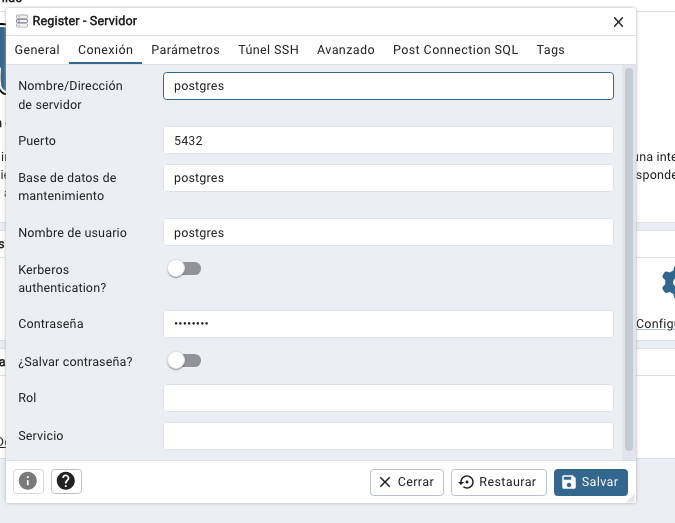

# Postgres

https://hub.docker.com/_/postgres

OJO: Cambiar la contraseña de postgres en el docker-compose.yml

```
docker compose up -d
o
docker-compose up -d
```

-d = ejecutar en segundo plano (background o detached)

```bash

docker-compose ps

docker-compose logs

docker-compose down
```

Acceder a pgAdmin a través de:
http://localhost:5050/




Conectar al contenedor de la base de datos:

```bash
docker exec -it postgres-db bash
```

Navegar al directorio `/var/lib/postgresql/data` y echar un vistazo a los archivos.

```bash
psql -U postgres      / -U es usuario
```

>> \l 
>> \c postgres  // conectar a la base de datos postgres
>> \du     // listar usuarios
>> \dt    // listar tablas
>> \?     // ayudar de comandos de psql metadatos

Usar <espacio> para más y 'q' para salir.


## Dictionary de datos

```sql
SELECT * FROM pg_catalog.pg_database;
SELECT * FROM pg_database;
SELECT * FROM pg_tables;

SELECT * FROM INFORMATION_SCHEMA.tables;

```