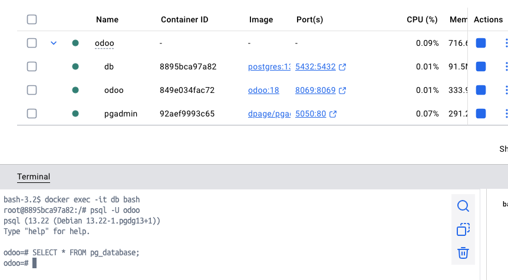

# Postgres

https://hub.docker.com/_/postgres

OJO: Cambiar la contraseña de postgres en el docker-compose.yml

```
docker compose up -d
o
docker-compose up -d
```

-d = ejecutar en segundo plano (background o detached)

```bash

docker-compose ps

docker-compose logs

docker-compose down
```

Acceder a pgAdmin a través de:
http://localhost:5050/




Conectar al contenedor de la base de datos:

```bash
docker exec -it postgres-db bash
```

Navegar al directorio `/var/lib/postgresql/data` y echar un vistazo a los archivos.

```bash
psql -U postgres      / -U es usuario
psql -U odoo    
```

>> \l 
>> \c postgres  // conectar a la base de datos postgres
>> \du     // listar usuarios
>> \dt    // listar tablas
>> \?     // ayudar de comandos de psql metadatos


| Command        | Description                                     |
| -------------- | ----------------------------------------------- |
| `\q`           | Quit `psql`                                     |
| `\l`           | List all databases                              |
| `\c dbname`    | Connect to a database                           |
| `\dt`          | List all tables in the current database         |
| `\d tablename` | Show schema/columns of a table                  |
| `\dv`          | List all views                                  |
| `\df`          | List all functions                              |
| `\du`          | List all roles/users                            |
| `\x`           | Toggle expanded output (useful for wide tables) |
| `\?`           | Show help for `psql` meta-commands              |
| `\h`           | Show SQL command syntax help                    |


Usar <espacio> para más y 'q' para salir.


## Dictionary de datos

```sql
SELECT * FROM pg_catalog.pg_database;
SELECT * FROM pg_database;
SELECT * FROM pg_tables;

SELECT * FROM INFORMATION_SCHEMA.tables;

```

Conectar a la base de datos postgres, con:
```bash
 \c postgres
```

y crear unas tablas:

```sql
CREATE TABLE test_table (
    id SERIAL PRIMARY KEY,
    name TEXT
);

INSERT INTO test_table (name) VALUES ('Alice');
SELECT * FROM test_table;
```