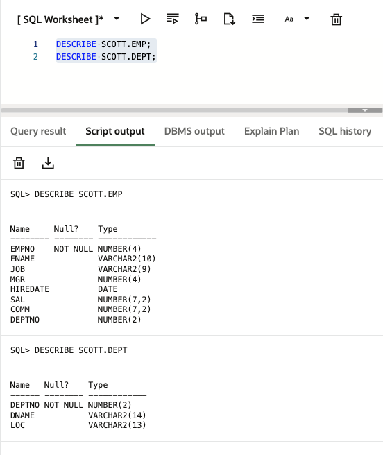
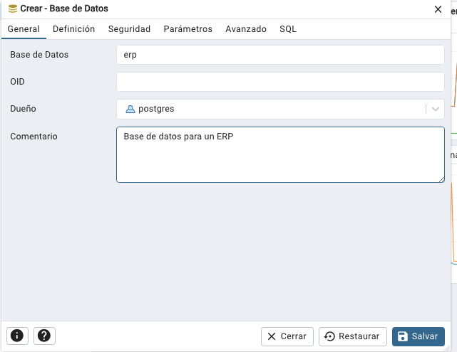
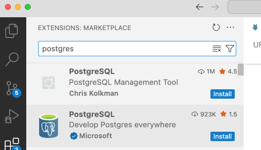

# Creación de base de datos:
- No hace falta asignar un OID (object ID) => legacy
- Template1 es por defecto


# Creacion de TABLES


Primero, crear un sequence y despues asignar un default value a la columna:
```sql
nextval('table1_seq') 
```

Tipos de datos (data types):
https://www.cheat-sheets.org/saved-copy/postgresql-cheat-sheet.pdf


Data Types de Arrays:
```sql
INSERT INTO table (value, values)
VALUES ('hello again', ARRAY['hello', 'hola']);

INSERT INTO table (value, values)
VALUES ('hello again', '{"hello", "hola"}');

SELECT * FROM public.table 
WHERE values[1] = 'hello';
-- Access 1st element (PostgreSQL arrays are 1-based)

SELECT value, unnest(values) AS values
FROM table;
```


El equivalente en Oracle es:
```sql
CREATE TYPE number_array AS VARRAY(10) OF NUMBER;

CREATE TABLE resultados (
    id NUMBER,
    scores number_array
);

INSERT INTO resultados (id, scores)
VALUES (1, number_array(10, 20, 30, 12));
INSERT INTO resultados (id, scores)
VALUES (2, number_array(6, 4, 1));

SELECT * 
FROM resultados;


```


## Actividades

### Actividad 1


```sql
INSERT INTO videojuegos (titulo, genero, lanzamiento, calificacion) VALUES
('The Legend of Zelda', 'Aventura', 1986, 9.5),
('Minecraft', 'Sandbox', 2011, 9.0),
('Among Us', 'Social', 2018, 8.2),
('Fortnite', 'Battle Royale', 2017, 7.8),
('Super Mario Bros', 'Plataforma', 1985, 9.7),
('Tetris', 'Puzzle', 1984, 9.3);
```

- Buscar juegos lanzados después del año 2000
- Ordenar los datos por calificación descendente
- Filtrar por género de 'Aventura
- Ver solo los títulos y sus calificaciones


### Actividad 2

Estas accediendo a PostgreSQL desde un contenedor Docker. Tienes el siguiente archivo SQL que queieres ejecutar usando la linea de comandos >>psql. Te dicen que puedes copiar el archivo de texto al contenedor, y ejecutar el comando psql desde dentro del contenedor. 

```bash
docker cp psql.test1.sql postgres-db:/psql.test1.sql   -- copiar el archivo al contenedor

>> psql -U postgres -d erp -f psql.test1.sql       -- ejecutar el archivo SQL desde la linea de comandos   

>> psql -U postgres -d erp -f psql.test1.sql > output.log  -- pipe el output a un archivo

```

```sql
-- Connectar a la base de datos
\c demo

-- Mostrar todas las tablas
\dt

-- Create a table
CREATE TABLE test1 (
    id SERIAL PRIMARY KEY,
    name TEXT NOT NULL,
    joined TIMESTAMP DEFAULT CURRENT_TIMESTAMP
);

-- Seed data
INSERT INTO test1 (name) VALUES
  ('Alice'), ('Bob');

-- Verify the rows
SELECT * FROM test1;

-- Show tables again
\dt
```

Ahora, repetir el proceso pero con un archivo de sql para mostrar todas las columnas de una tabla. Usar INFORMATION_SCHEMA.columns.


¿Qué hace el siguiente código? Ejecutarlo.
```sql
-- Ask the user for the table name
\prompt 'Introducir un nombre de una tabla: ' tblname

-- Use the input in a SELECT
SELECT * FROM :tblname LIMIT 5;

-- Describe the table structure
\d :tblname
```


### Actividad 2
Usando Oracle Live, migrar la base de datos de Scott (emp, dept) a PostgreSQL. Incluir esquema y algunos datos.




**Strategy:**
WAL (Write-Ahead Logging):

Registra todas las modificaciones realizadas en la base de datos, lo que permite recuperar el estado exacto hasta el momento del último registro en caso de un fallo.

Ideal para recuperación a punto en el tiempo (PITR) en producción.

Más complejo y requiere gestionar los archivos de WAL de manera continua.

File Copy:

Realiza una copia completa de los archivos del sistema de base de datos en un momento específico.

Más sencillo y rápido, ideal para desarrollo o respaldos rápidos.

No permite una recuperación a punto en el tiempo, pero es suficiente para muchos entornos de desarrollo.

Recomendación:
Desarrollo: Usa File Copy por su simplicidad.

Producción: Usa WAL si necesitas recuperación precisa y a punto en el tiempo.

**Locale**
Las opciones de **locale** en PostgreSQL definen cómo se manejan la comparación de cadenas, el ordenamiento, la clasificación de caracteres, y el formato de fechas y números. Aquí están las opciones explicadas brevemente:

1. **libc**:  
   - Basado en la biblioteca C del sistema operativo. Utiliza la configuración local del sistema para el ordenamiento y la clasificación de caracteres.
   - **Recomendado para**: Desarrollo simple en un solo idioma, cuando no necesitas soporte avanzado para idiomas o caracteres complejos.

2. **ICU (International Components for Unicode)**:  
   - Proporciona un soporte más avanzado para la internacionalización, con mejores reglas de ordenamiento y clasificación para muchos idiomas diferentes.
   - **Recomendado para**: Aplicaciones que necesitan manejar varios idiomas o que requieren un manejo complejo de caracteres, como idiomas con alfabetos no latinos (ej. chino, árabe).

3. **Builtin**:  
   - Opciones locales básicas incorporadas en PostgreSQL, sin depender de bibliotecas externas como **libc** o **ICU**.
   - **Recomendado para**: Casos muy específicos, generalmente no se recomienda para la mayoría de los proyectos.

**Resumen**:  
- **libc** para proyectos simples en un solo idioma.
- **ICU** para proyectos multilingües o que necesitan soporte avanzado de caracteres.
- **Builtin** solo en casos muy específicos.




# VS Code Extension



# Postgres Docs
https://www.postgresql.org/docs/17/index.html
