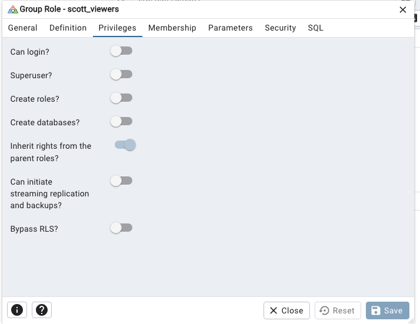
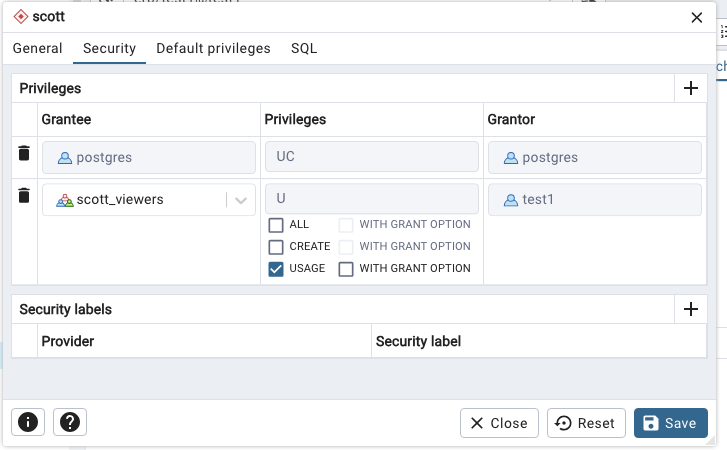
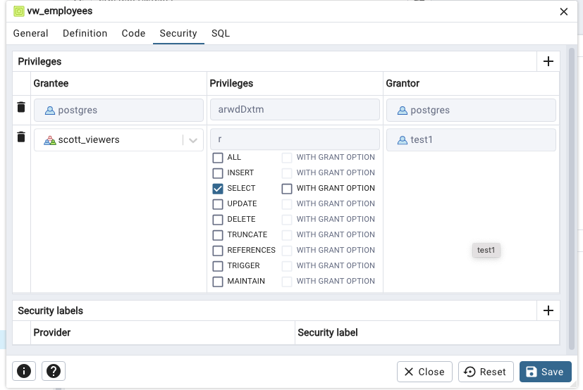
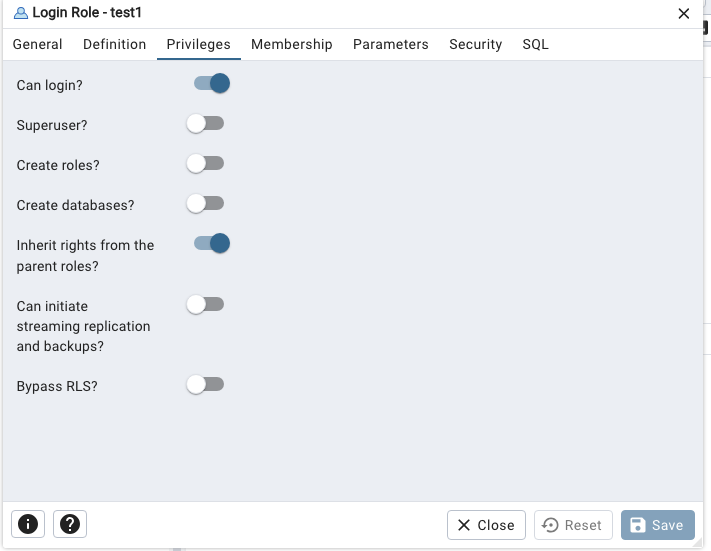
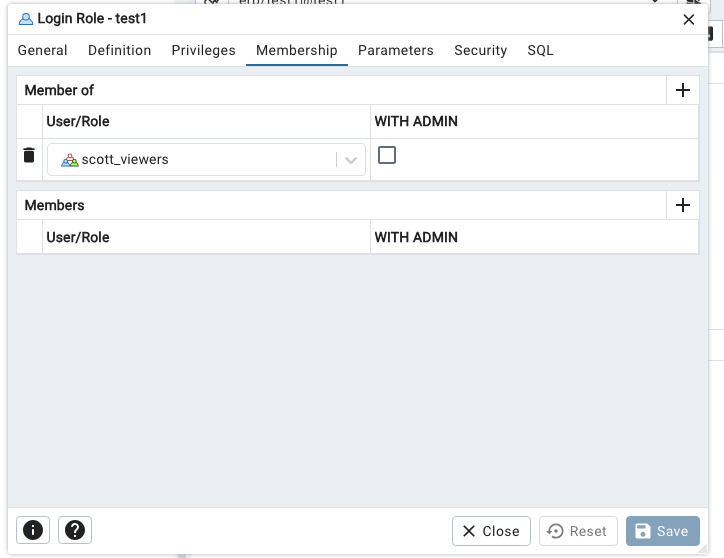
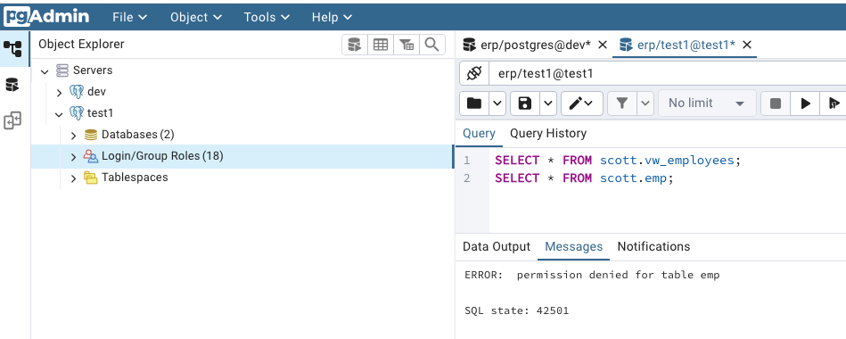

# Grupos y usuarios

1. ¿Qué es un rol?
En PostgreSQL, un rol es una entidad que puede tener permisos y atributos.

Técnicamente, no hay distinción estricta entre "usuario" y "rol":

Un usuario es un rol con la capacidad de iniciar sesión (LOGIN).

Un grupo es un rol que generalmente no tiene LOGIN, y se usa para agrupar usuarios.

2. ¿Qué es un usuario?
Es un rol que tiene el atributo LOGIN activado, es decir, puede conectarse a la base de datos.

Cada usuario tiene un nombre y puede tener permisos propios (sobre tablas, esquemas, etc.).

Ejemplo:

```sql
CREATE ROLE juan WITH LOGIN PASSWORD 'secreto';
```

3. ¿Qué es un grupo?
Un grupo es simplemente un rol que no tiene LOGIN y se utiliza para agrupar usuarios.

Sirve para facilitar la gestión de permisos:
En lugar de dar permisos a cada usuario individualmente, se crean grupos con permisos, y los usuarios heredan esos permisos al pertenecer al grupo.

Ejemplo:

```sql
CREATE ROLE desarrolladores NOLOGIN;
GRANT desarrolladores TO juan;
```
Aquí juan pertenece al grupo desarrolladores.


# Ejemplo practico para configurar permisos para una vista

1. Crear un rol de "scott_viewers" sin contraseña ni "Can Login?". 




2. Asignar privilegios de USAGE al esquema "scott".




3. Asignar privilegios de SELECT a la vista "ve_empleados".



4. Crear un nuevo usuario "test1" con contraseña "test1". 

- Darle la opcion de "Can Login?" 
- Asignarle el rol "scott_viewers".




5. Iniciar sesion con el usuario "test1" y comprobar que solo puede ver la vista "ve_empleados".


