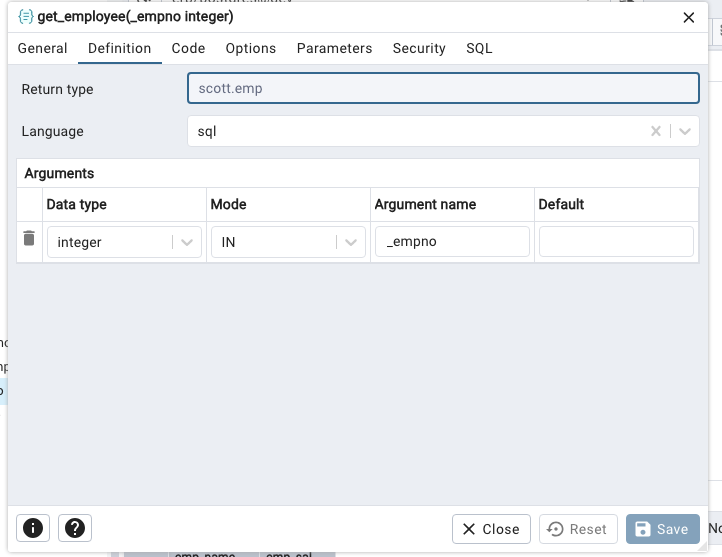
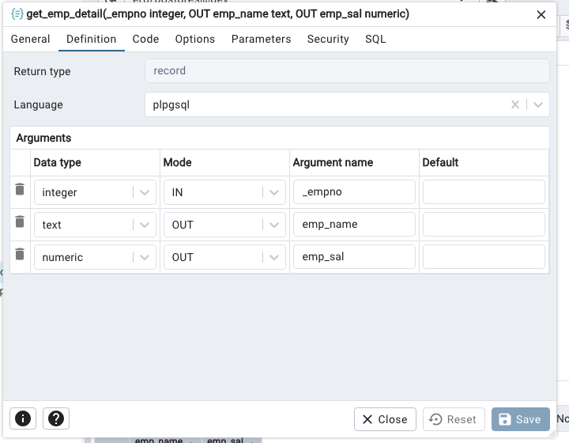
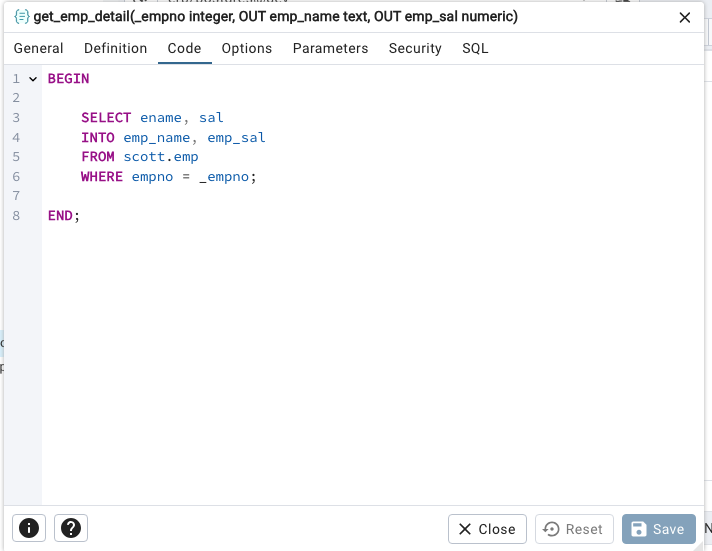

# Funciones
Una función es un bloque de código que se guarda en la base de datos y que puedes ejecutar con un solo llamado. Puede recibir parámetros, hacer operaciones, consultas, cálculos y devolver resultados (un valor, varias filas, o nada).

## Tipos de funciones en PostgreSQL
- Funciones SQL: Definidas con un solo query SQL. Son rápidas y simples para consultas directas.

- Funciones PL/pgSQL: Permiten lógica procedural (variables, bucles, condicionales), ideal para operaciones complejas.

- Otras: PL/Python, PL/Perl, etc. para extender funcionalidad con otros lenguajes.

## ¿Por qué usar funciones?
1. Reutilización de código
Escribes la lógica una vez y la llamas desde cualquier consulta o aplicación.

Facilita mantenimiento y reduce errores.

2. Encapsulación
Ocultan la complejidad de operaciones complejas.

Simplifican el uso para usuarios y aplicaciones.

3. Mejor rendimiento
Al ejecutarse en la base, evitas enviar muchas consultas desde la aplicación.

Se puede optimizar dentro del motor.

4. Seguridad
Puedes controlar permisos de ejecución en vez de dar acceso directo a las tablas.

5. Modularidad
Divides el trabajo en partes lógicas.

Facilita el desarrollo y pruebas.

## Ejemplo

```sql
CREATE FUNCTION scott.obtener_salario(p_empno INTEGER)
RETURNS NUMERIC AS $$
DECLARE
    salario NUMERIC;
BEGIN
    SELECT sal INTO salario FROM scott.emp WHERE empno = p_empno;
    RETURN salario;
END;
$$ LANGUAGE plpgsql;
```

## Ejemplo de uso:
```sql
SELECT scott.obtener_salario(7839);

SELECT *, scott.obtener_salario(empno)
FROM scott.emp

SELECT * FROM scott.emp
WHERE scott.obtener_salario(empno) > 1000
```


--- 
```sql
SELECT * FROM scott.get_employee(1234);

SELECT *, scott.get_employee_count() AS total
FROM scott.get_employee(1234);

```




```sql
CREATE OR REPLACE FUNCTION scott.get_employee(
	_empno integer)
    RETURNS scott.emp
    LANGUAGE 'sql'
    COST 100
    VOLATILE PARALLEL UNSAFE
AS $BODY$
SELECT * 
FROM scott.emp
WHERE empno = _empno
LIMIT 1;
$BODY$;

ALTER FUNCTION scott.get_employee(integer)
    OWNER TO postgres;

```

# SELECT INTO

Empezamos con una consulta SELECT.

```sql
SELECT ename, sal
FROM scott.emp
WHERE empno = 7839
````

Crear la funcion y modificar la consulta SELECT para usar un SELECT INTO.






CREATE OR REPLACE FUNCTION scott.get_emp_details(
    p_empno INTEGER,
    OUT emp_name TEXT,
    OUT emp_salary NUMERIC
)
AS $$
BEGIN
    SELECT e.ename, e.sal
    INTO emp_name, emp_salary
    FROM emp e
    WHERE e.empno = p_empno;
END;
$$ LANGUAGE plpgsql;


# Get Employee Count

```sql

CREATE OR REPLACE FUNCTION scott.get_employee_count(
	)
    RETURNS integer
    LANGUAGE 'sql'
    COST 100
    VOLATILE PARALLEL UNSAFE
AS $BODY$
SELECT count(*) As TotalEmployees
FROM scott.emp;
$BODY$;

ALTER FUNCTION scott.get_employee_count()
    OWNER TO postgres;

```

# Actividades
Usando la misma esquema de productos y sus ventas, realizar funciones para los siguientes casos:
- total vendido de un producto

```sql
CREATE SCHEMA IF NOT EXISTS tienda
    AUTHORIZATION postgres;

CREATE TABLE tienda.productos (
    id SERIAL PRIMARY KEY,
    nombre VARCHAR(100),
    categoria VARCHAR(50),
    precio DECIMAL(10,2)
);

CREATE TABLE tienda.ventas (
    id SERIAL PRIMARY KEY,
    producto_id INT REFERENCES tienda.productos(id),
    cantidad INT,
    fecha_venta DATE
);

INSERT INTO tienda.productos (nombre, categoria, precio) VALUES
('Camiseta', 'Ropa', 20.00),
('Pantalón', 'Ropa', 35.50),
('Zapatos', 'Calzado', 50.00),
('Sandalias', 'Calzado', 25.00),
('Gorra', 'Accesorios', 15.00);

INSERT INTO tienda.ventas (producto_id, cantidad, fecha_venta) VALUES
(1, 3, '2025-05-01'),
(2, 1, '2025-05-03'),
(3, 2, '2025-05-05'),
(1, 1, '2025-05-07'),
(5, 4, '2025-05-10'),
(4, 2, '2025-05-11');

```


## Ejemplo codigo

```plpgsql
DO $$
DECLARE
    salario NUMERIC;
	resultado NUMERIC;
BEGIN
    SELECT sal INTO salario 
	FROM scott.emp 
	WHERE empno = 7839;

	resultado := salario + 100;

	RAISE NOTICE 'Salario: %', resultado;
 
	
END;
$$ LANGUAGE plpgsql;
```

## Respuestas
```sql
SELECT SUM(cantidad)
from tienda.ventas
WHERE producto_id = _id

```