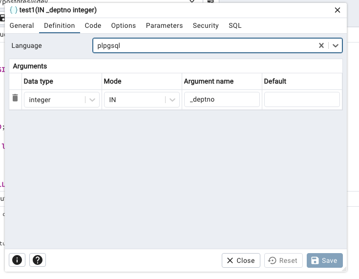
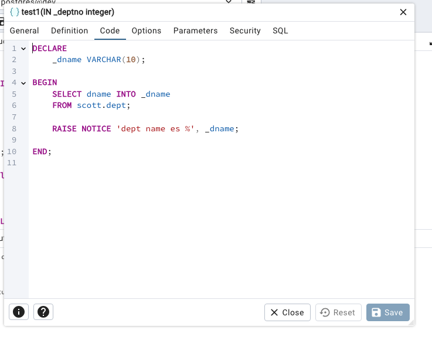

Empezamos con un esqueleto o plantilla, de lo que se converitría más adelante en un procedimiento almacenado:

```sql

```plpgsql
DO $$

DECLARE
	id integer := 0;

BEGIN

	RAISE NOTICE 'hola %', id;

END;

$$ language plpgsql
```

Se puede convertir el mensaje en un error asi:
```sql
RAISE EXCEPTION 'error %', id;
```

Ahora, añadimos _deptno, que va a ser una variable de entrada (IN). Usamos la variable _dname en la clausula INTO para almacenar el resultado de la consulta.

```sql
DO $$

DECLARE
	_deptno INTEGER := 10;
	_dname VARCHAR(10);

BEGIN
	SELECT dname INTO _dname
	FROM scott.dept;

	RAISE NOTICE 'dept name es %', _dname;

END;

$$ language plpgsql

```

Ahora, vamos a crear un procedimiento almacenado. Para ello, creamos una función que imprime un valor (en este caso, el nombre del departamento) y la llamamos con el bloque CALL.

```sql
CALL scott.print_deptname(10);
```

IMPORTANTE: Fijate como hemos quitado el parámetro IN de _deptno, ya que forma parte de los parámetros del procedimiento.





https://www.postgresql.org/docs/current/plpgsql-statements.html

Ejemplo 2:
```sql
	IF _dname = 'ACCOUNTING' THEN
		RAISE NOTICE 'Ahh, CONTABILIDAD';
	ELSE
		RAISE NOTICE 'dept name es %', _dname;
	END IF;

```

EJemplo 3:
```sql
DECLARE
	_deptno INTEGER := 101;
	_dname VARCHAR(100) := 'Dept Nombre';
	_loc VARCHAR(200) := 'Bilboa';
	
BEGIN

	IF _loc <> 'San Sebastian' THEN
		INSERT INTO scott.dept (deptno, dname, loc)
		VALUES (_deptno, _dname, _loc);
	ELSE
		RAISE EXCEPTION 'No se puede tener una ubicacion de San Sebastian';
	END IF;

	

END;

```
Ejemplo 4: Borrar
```sql
	IF EXISTS (SELECT 1 FROM scott.dept WHERE deptno = _deptno) THEN
		DELETE FROM scott.dept WHERE deptno = _deptno;
	ELSE
		RAISE NOTICE 'Dept % doesnt exist', _deptno;
	END IF;
```

## Actividades

### Actividad 1: UPSERT
Actualizar el procedimiento de ejemplo 4 en la tabla scott.dept. Queremos que sea un UPSERT, es decir, si existe lo actualizamos y si no existe lo insertamos.

NOTAS:
El término upsert proviene de la combinación de dos palabras en inglés: update (actualizar) y insert (insertar). Un upsert es una operación en bases de datos que intenta insertar un nuevo registro, pero si ese registro ya existe (normalmente determinado por una clave primaria o única), en lugar de insertar un duplicado, actualiza el registro existente con los nuevos datos.

Es decir, upsert = insertar si no existe, actualizar si existe.

Ahora, cambiar el contenido del procedimiento para que use la sentencia ON CONFLICT de postgres:
```sql
INSERT INTO scott.dept (deptno, dname, loc)
	VALUES (50, 'RESEARCHes', 'BARCELONA')
	ON CONFLICT (deptno)
	DO UPDATE SET
	    dname = EXCLUDED.dname,
	    loc = EXCLUDED.loc;

```


---


```bash
npm install pg

```

Si quieres usar OUT, hay que usar *plpgsql*
```sql
BEGIN
    INSERT INTO public.users (firstname, lastname, active)
    VALUES (_firstname, _lastname, true)
    RETURNING userid INTO new_userid;
END;
```

```sql
DO $$
	DECLARE newid integer;
BEGIN
	CALL public.insert_user('Adams', 'JJ', newid);
	RAISE NOTICE 'new id is %', newid;
END $$
```


```sql

CREATE OR REPLACE PROCEDURE insert_employee(
    p_empno     INTEGER,
    p_ename     VARCHAR,
    p_job       VARCHAR,
    p_mgr       INTEGER,
    p_hiredate  DATE,
    p_sal       NUMERIC,
    p_comm      NUMERIC,
    p_deptno    INTEGER
)
LANGUAGE plpgsql
AS $$
BEGIN
    INSERT INTO scott.emp (
        empno, ename, job, mgr, hiredate, sal, comm, deptno
    ) VALUES (
        p_empno, p_ename, p_job, p_mgr, p_hiredate, p_sal, p_comm, p_deptno
    );

    RAISE NOTICE 'Employee % inserted successfully.', p_ename;
END;
$$;


CREATE OR REPLACE PROCEDURE upsert_department(
    p_deptno INTEGER,
    p_dname  VARCHAR,
    p_loc    VARCHAR
)
LANGUAGE plpgsql
AS $$
BEGIN
    IF EXISTS (SELECT 1 FROM scott.dept WHERE deptno = p_deptno) THEN
        -- Update existing department
        UPDATE scott.dept
        SET dname = p_dname,
            loc = p_loc
        WHERE deptno = p_deptno;

        RAISE NOTICE 'Department % updated.', p_deptno;
    ELSE
        -- Insert new department
        INSERT INTO scott.dept (deptno, dname, loc)
        VALUES (p_deptno, p_dname, p_loc);

        RAISE NOTICE 'Department % inserted.', p_deptno;
    END IF;
END;
$$;


	DELETE FROM biblioteca.socios WHERE id_socio = p_id;

    IF NOT FOUND THEN
        RAISE NOTICE 'No se encontró socio con ID %', p_id;
    ELSE
        RAISE NOTICE 'Socio con ID % eliminado.', p_id;
    END IF;


```