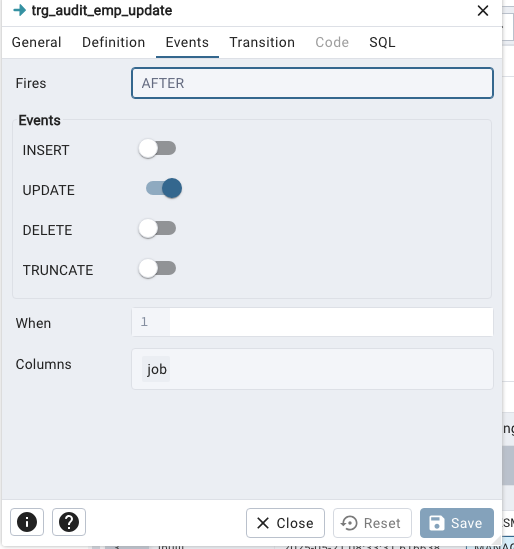

# rules - not available in sql server


# Triggers

## Ejemplo 1:

Queremos aplicar un trigger para que el puesto (JOB) este guardado en MAYÚSCULAS siempre. Aplicaremos un trigger al ejecutar un comando de INSERT o UPDATE.

```sql
INSERT INTO scott.emp (empno, ename, job, mgr, hiredate, sal, deptno)
VALUES (1234, 'Alice', 'developer', NULL, CURRENT_DATE, 3000, 10);
```

Empezamos creando una funcion que manejará los datos:
```sql
CREATE OR REPLACE FUNCTION scott.uppercase_job()
RETURNS TRIGGER AS $$
BEGIN
    -- tenemos acceso a NEW y OLD tables, por ejemplo, NEW.job y OLD.job
    RETURN NEW;
END;
$$ LANGUAGE plpgsql;
```

Ahora, incluir la lógica que hay que aplicar:
```sql
NEW.job = UPPER(NEW.job);
```

Finalmente, aplicamos la funcion a la tabla como TRIGGER para disparar l INSERT y UPDATE.

## Ejemplo 2:

Vamos a empezar con un ejemplo para auditar
```sql

CREATE TABLE IF NOT EXISTS scott.audit
(
    ename character varying COLLATE pg_catalog."default",
    action_time timestamp without time zone
)


CREATE OR REPLACE FUNCTION scott.audit_emp_insert()
RETURNS TRIGGER AS $$
BEGIN
    INSERT INTO scott.audit(ename, action_time)
    VALUES (NEW.ename, now());
    RETURN NEW;
END;
$$ LANGUAGE plpgsql;

select *  FROM pg_catalog.pg_proc
where proname LIKE 'audi%';


CREATE TRIGGER trg_audit_emp_insert
AFTER INSERT ON scott.emp
FOR EACH ROW
EXECUTE FUNCTION scott.audit_emp_insert();

```


Ejemplo, modificamos la tabla y añadimos una columna de 'job'. Modificamos la funcion para que scott.audit_emp_update() y colocamos la funcion en un trigger de UPDATE que dispare solo para la columna 'job' de la tabla emp.




Ejemplo de Validación antes de insertar

Queremos evitar que el usuario introducza un valor de NULO en el campo 'dname':

```sql
INSERT INTO scott.dept (deptno, dname, loc)
VALUES (300, NULL, 'SS')


-- cuerpo de la funcion
BEGIN
  IF NEW.dname IS NULL THEN
    RAISE EXCEPTION 'Name cannot be null';
  END IF;
  
  -- Return NEW to proceed with the update using this new row data
  RETURN NEW;
END;


```


## Actividades

**Actividad 1**
A veces, los usuarios se olvidan a pasar la fecha de comienzo (hire date) al INSERTar un nuevo empleado. Aunque si se puede usar otras funciones de Postgres para llevarlo a cabo, crear un trigger para asignar un valor por defecto (CURRENT_DATE), si no lo recibe.

```sql
INSERT INTO scott.emp (empno, ename, job, sal, deptno)
VALUES (8888, 'Bob', 'CLERK', 2000, 30);

SELECT empno, ename, hiredate FROM scott.emp WHERE empno = 8888;
```

**Actividad 2**
Crear un trigger al INSERTar un empleado. Vamos a comprobar que el departamento tiene un presupuesto suficiente para contratar nuevos empleados. Por ejemplo, si "Marketing" tienen 20,000 euros de presupuesto, si puede contratar (y insertar un nuevo empleado). Si es 10,000 o menos, entonces, NO. Habrá que añadir una nueva columna 'budget' y agregar unos datos.

```sql
ALTER TABLE scott.dept
ADD COLUMN IF NOT EXISTS budget numeric;
```

No te olvides en actualizar los datos.

Ejecutarás un insert para un nuevo empleado asi:

```sql
INSERT INTO scott.emp (empno, ename, job, sal, deptno)
VALUES (8888, 'Bob', 'clerk', 2000, 10);
```

Para ayudar, quizas quieres empezar desarrollando asi:

```sql

DO $$
DECLARE
	-- ¿qué variables intermedios hace falta?
	_deptno integer :=10 ;
	
BEGIN
	SELECT budget INTO ....
	
  	IF ... THEN
    	-- RAISE NOTICE 'No permitido';
  --RETURN NEW;
END;
$$ LANGUAGE plpgsql;

```

**Avanzado**
Teniendo una table de auditar para lo departamentos, queremos mantener la historial de cambios:
**NOTA: Ver la respuesta abajo con JSONB para una solución más flexible**

Quizas queiras añadir el usuario conectado también: SELECT current_user;

```sql
-- Tabla para auditoría de cambios en departamento
CREATE TABLE IF NOT EXISTS scott.dept_audit (
    audit_id SERIAL PRIMARY KEY,
    deptno INTEGER,
    old_dname VARCHAR(14),
    new_dname VARCHAR(14),
    old_loc VARCHAR(13),
    new_loc VARCHAR(13),
    change_time TIMESTAMP DEFAULT now()
);
```

Insertar los cambios de OLD y NEW en los respectivos campos al ejecutar un UPDATE.

## Respuestas

```sql

-- Función trigger para registrar cambios
CREATE OR REPLACE FUNCTION scott.log_dept_changes()
RETURNS TRIGGER AS $$
BEGIN
    -- Solo registrar si hay cambios en dname o loc
    IF OLD.dname IS DISTINCT FROM NEW.dname OR OLD.loc IS DISTINCT FROM NEW.loc THEN
        INSERT INTO scott.dept_audit(deptno, old_dname, new_dname, old_loc, new_loc)
        VALUES (OLD.deptno, OLD.dname, NEW.dname, OLD.loc, NEW.loc);
    END IF;
    RETURN NEW;
END;
$$ LANGUAGE plpgsql;

-- Crear el trigger AFTER UPDATE
CREATE TRIGGER trg_dept_log_changes
AFTER UPDATE ON scott.dept
FOR EACH ROW
EXECUTE FUNCTION scott.log_dept_changes();


CREATE OR REPLACE FUNCTION trg_set_default_hiredate()
RETURNS TRIGGER AS $$
BEGIN
  IF NEW.hiredate IS NULL THEN
    NEW.hiredate := CURRENT_DATE;
  END IF;
  RETURN NEW;
END;
$$ LANGUAGE plpgsql;


CREATE OR REPLACE FUNCTION scott.trg_verify_budget()
RETURNS TRIGGER AS $$
DECLARE
	_budget numeric;
BEGIN
	SELECT budget INTO _budget
	FROM scott.dept
	WHERE deptno = NEW.deptno;
	
  	IF _budget IS NULL OR _budget < 20000 THEN
    	RAISE EXCEPTION 'No esta permitido.';
	ELSE
		RETURN NEW;
  	END IF;

END;
$$ LANGUAGE plpgsql;

```

Usando JSONB tipo de dato, se puede montar un audit table que vale para cualquier tabla. 
Fijáte en TG_OP y TG_TABLE_NAME, accesible dentro de una funcion de un TRIGGER.

```sql
CREATE TABLE IF NOT EXISTS scott.log
(
    accion text COLLATE pg_catalog."default",
    datos jsonb,
    fecha timestamp without time zone DEFAULT now(),
    usuario text COLLATE pg_catalog."default",
    datos_viejos jsonb,
    tabla text COLLATE pg_catalog."default"
)


CREATE OR REPLACE FUNCTION scott.log_scott()
    RETURNS trigger
    LANGUAGE 'plpgsql'
    COST 100
    VOLATILE NOT LEAKPROOF
AS $BODY$
BEGIN

IF TG_OP = 'INSERT' THEN
    INSERT INTO scott.log (accion,datos,usuario,tabla)
VALUES (TG_OP,to_jsonb(NEW),CURRENT_USER,TG_TABLE_NAME);
RETURN NEW;
ELSIF TG_OP = 'UPDATE' THEN
    INSERT INTO scott.log (accion,datos,datos_viejos,usuario,tabla)
VALUES (TG_OP,to_jsonb(NEW),to_jsonb(OLD),CURRENT_USER,TG_TABLE_NAME);
RETURN NEW;
ELSIF TG_OP = 'DELETE' THEN
INSERT INTO scott.log (accion,datos_viejos,usuario,tabla)
VALUES (TG_OP,to_jsonb(OLD),CURRENT_USER,TG_TABLE_NAME);
RETURN OLD;
END IF;
```