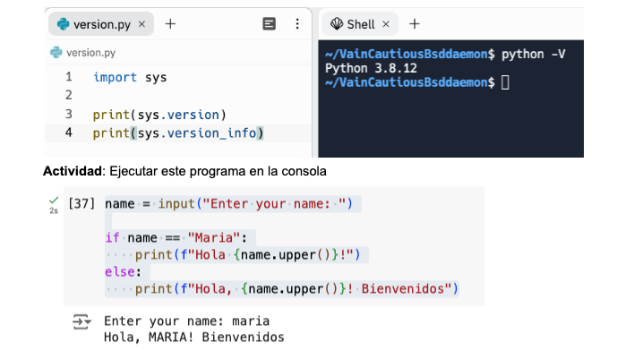
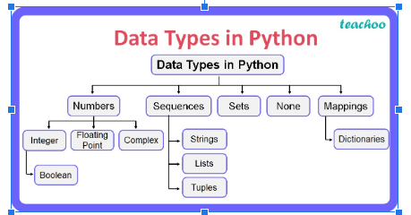
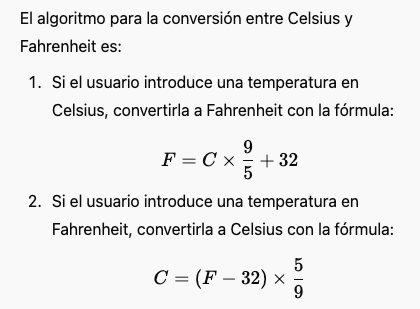
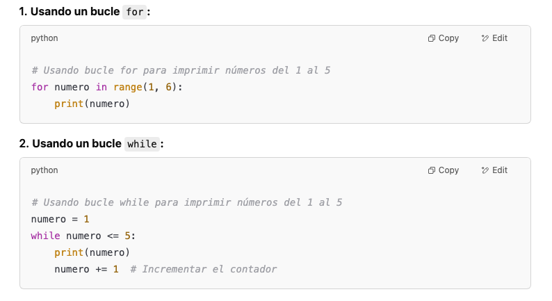
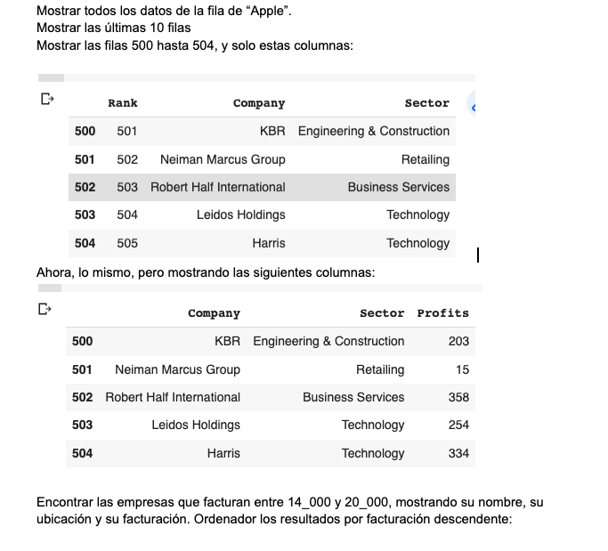

# Introduccion a Python




## Comandos básicos
- tipos de datos
- input, print (input => procesar => output)
- condiciones: if elif else
- bucles for, while y con listas
- functions
- dictionaries
- archivos, pandas (csv)

### Tipos de datos


En Este juego interactivo de personalidad, el usuario responderá algunas preguntas sobre su *nombre*, *edad*, *altura* y *sus gustos en programación*. El programa utiliza diferentes tipos de datos  como cadenas de texto (str), enteros (int), flotantes (float) y booleanos (bool) para recoger y procesar la información. Al final, el programa genera un mensaje personalizado y divertido basado 
en las respuestas del usuario.

Por ejemplo:
output : 'Hola Juan. Veo que tienes 18 años, mides 176 centimétros, y no te gusta la programacion.'

### Condiciones con if
**Deportes**
Teniendo la lista de tenistas, preguntar al usuario por su tenista favorita y mostrar un mensaje según:

| Tenista  | Mensaje                                     |
|----------|---------------------------------------------|
| Nadal    | ¡Yo también soy fan!                       |
| Alcaraz  | Bueno, le falta experiencia todavía…       |
| Badosa   | Lleva poco en las pistas después de una lesión |
| Muguruza | Tiene sus altas y bajas                    |


**Conversion de temperaturas**
Convertir la temperatura en Celsius a Fahrenheit y vice versa. Preguntar el usuario tanto por la temperatura como la conversion:



**Pruebas unitarias (Unit Tests)**
Llevar a cabo una prueba unitaria (unit test)
| Prueba | Input       | Output esperado  | Output actual | PASS/FAIL |
|--------|------------|------------------|---------------|-----------|
| 1      | Celsius 31 | Fahrenheit 87.8  |               |           |
| 2      | Celsius 12 | Fahrenheit 53.6  |               |           |
| 3      | Fahrenheit 99 | Celsius 37.22 |               |           |


## Bucles
- for
- while



**HTML img Simulacro**
Vamos a simular la carga de imagenes 6 veces en una página (imprimir el resultado en HTML con print). AL pasar una variable i, conseguimos imagenes aleatorias.

`<img src="https://picsum.photos/200/300?random={i}" `

**GET Simulacro**
Vamos a simular una peticion GET (print) hasta que usuaria diga que no quiera continuar. Usar un bucle while. Cada iteración, preguntarle si quiere continuar...


**Blast Off!**
Crear un programa en Python que haga una cuenta regresiva desde 10 hasta 1, y luego imprima el mensaje "¡Despegue!" al final, simulando el lanzamiento de un cohete al espacio. Usar el módulo time para que cuente más lento.
```python
import time
time.sleep(1)
```

# Listas

Completar esta aplicacion para la gestión de páginas webs

```python

paginas_web = []

while True:
    print("\n--- Gestor de páginas webs - Menú ---")
    print("1. Añadir página web")
    print("2. Ver todas las páginas web")
    print("3. Salir")
    
    opcion = input("Selecciona una opción (1-3): ")

````

## Funciones
```python
def saludar(nombre):
    print(f"¡Hola, {nombre}!")

# Llamada a la función con un nombre
saludar("Juan")
```

**Matemáticas**
Crear unas funciones para sumar(x, y), restar, dividir y multiplicar. El usuario introducirá dos numeros y una accion.

**Volumen de agua en una piscina rectangular**
La fórmula para calcular el volumen de agua en una piscina rectangular es:

Volumen = Longitud × Ancho × Profundidad
Volumen=Longitud×Ancho×Profundidad

# Dictionaries

```python
person = {
    'name': 'John',
    'age': 30
}

print(person["name"])
person["age"] = 35
```


```python
students = {
    'Alice': {'age': 20, 'grades': {'Math': 85, 'Science': 90}},
    'Bob': {'age': 22, 'grades': {'Math': 78, 'Science': 88}},
    'Charlie': {'age': 21, 'grades': {'Math': 92, 'Science': 87}},
}

alice = students['Alice']

print(alice["age"])
alice["age"] = 21
print(alice["age"])
```

Podrias terminar este programa usando un diccionario para gestionar los contactos:
```python

libro_de_contactos = [] # se guardará cada contacto como un diccionario dentro una lista


def main():
    while True:
        print("\nMenú del Libro de Contactos:")
        print("1. Agregar Contacto")
        print("2. Ver Todos los Contactos")
        print("3. Salir")
        
        opcion = input("Elige una opción (1-3): ")
        
        if opcion == "1":
            agregar_contacto()
            # pista: hay que usar libro_de_contactos.append()
        elif opcion == "2":
            ver_todos_los_contactos()
        elif opcion == "3":
            print("¡Adiós!")
            break
        else:
            print("Opción no válida, por favor intenta de nuevo.")
```


# Archivos

```python
# Abrir y leer el archivo
with open("input.txt", "r") as file:
    content = file.read()

# Modificar el contenido
modified_content = content.upper()

# Guardar el contenido en un nuevo archivo
with open("output.txt", "w") as file:
    file.write(modified_content)

print("Archivo guardado con éxito.")
```


# Pandas

https://pandas.pydata.org/Pandas_Cheat_Sheet.pdf

```python
import pandas as pd

# Read CSV file into DataFrame
df = pd.read_csv('output.csv')

# Display the first few rows of the DataFrame
print(df.head())

data = {
    'Name': ['John', 'Alice', 'Bob'],
    'Age': [28, 34, 25],
    'City': ['New York', 'Los Angeles', 'Chicago']
}

df = pd.DataFrame(data)

# Write the DataFrame to a CSV file
df.to_csv('output.csv', index=False)
```

Operaciones básicas de DataFrame
```python
df.head()
df.tail()
df["Nombre"]    df[["Nombre", "Edad"]]  # columnas
df.iloc[1] df.iloc[0:2] # ubicacion por indice
df.loc[0:1, ["Nombre", "Edad"]]

```

### Actividades de pandas

**Actividad 1**:
https://github.com/sivabalanb/Data-Analysis-with-Pandas-and-Python/blob/master/fortune1000.csv



**Actividad 2:**
```python
data = {
    "Producto": ["Laptop", "Camiseta", "Sofá", "Auriculares", "Chaqueta", "Tablet", "Cámara", "Zapatos", "Refrigerador", "Smartphone"],
    "Categoría": ["Electrónica", "Ropa", "Hogar", "Electrónica", "Ropa", "Electrónica", "Electrónica", "Ropa", "Hogar", "Electrónica"],
    "Precio": [1200, 25, 700, 100, 150, 500, 300, 80, 1200, 700],
    "Cantidad vendida": [5, 100, 10, 150, 50, 30, 40, 70, 15, 60],
    "Fecha de venta": pd.to_datetime([
        "2023-01-10", "2023-01-11", "2023-01-12", "2023-01-13", "2023-01-14", 
        "2023-01-15", "2023-01-16", "2023-01-17", "2023-01-18", "2023-01-19"
    ])
}

```

El departamento de ventas necesita los siguientes datos:

| Producto    | Precio |
|-------------|--------|
| Auriculares | 100    |
| Chaqueta    | 150    |
| Tablet      | 500    |
| Cámara      | 300    |

Fijáte en el precio (filtrar) y en el ordén:

| Producto    | Categoría   | Precio | Cantidad vendida | Fecha de venta |
|-------------|-------------|--------|------------------|----------------|
| Sofá        | Hogar       | 700    | 10               | 2023-01-12     |
| Smartphone  | Electrónica | 700    | 60               | 2023-01-19     |
| Laptop      | Electrónica | 1200   | 5                | 2023-01-10     |
| Refrigerador| Hogar       | 1200   | 15               | 2023-01-18     |

Para actualizar un valor, usar `df.loc[condición, 'columna'] = nuevo_valor`

Actualizar el precio de Camisetas a 100 euros.

Encontrar los top 5 vendidas. Usar `df.nlargest`. ¿Y los menos vendidos?

Añadir un nuevo producto. Terminar con los datos necesarios:
new_row = {"Producto": "Sofá", "Categoría": "Hogar" ... }

usar: `df.loc[len(df)] = new_row`

# Python Turtle
```python
import turtle

# Set up the screen
screen = turtle.Screen()
screen.bgcolor("white")  # Background color of the screen

# Create a turtle object
t = turtle.Turtle()

# Customize the turtle
t.shape("turtle")
t.color("green")
t.speed(2)  # Set turtle speed (1 - slowest, 10 - fastest)

# Draw a square
for _ in range(4):
    t.forward(100)  # Move forward by 100 units
    t.left(90)      # Turn by 90 degrees

# Finish the drawing
turtle.done()
```
---

### Demo
Tipos de datos

```python
# Tipos de Datos en Python

# 1. Enteros (int)
entero = 42
print(type(entero), entero)  # <class 'int'> 42

# 2. Flotantes (float)
flotante = 3.14
print(type(flotante), flotante)  # <class 'float'> 3.14

# 3. Cadenas de texto (str)
cadena = "Hola, Python!"
print(type(cadena), cadena)  # <class 'str'> Hola, Python!

# 4. Booleanos (bool)
booleano = True
print(type(booleano), booleano)  # <class 'bool'> True

# 5. Listas (list) - Colección ordenada y mutable
lista = [1, 2, 3, "Python", 3.14]
print(type(lista), lista)  # <class 'list'> [1, 2, 3, 'Python', 3.14]

# 6. Tuplas (tuple) - Colección ordenada e inmutable
tupla = (1, "Hola", 3.14)
print(type(tupla), tupla)  # <class 'tuple'> (1, 'Hola', 3.14)

# 7. Conjuntos (set) - Colección desordenada y sin duplicados
conjunto = {1, 2, 3, 3, 2, 1}
print(type(conjunto), conjunto)  # <class 'set'> {1, 2, 3}

# 8. Diccionarios (dict) - Colección de pares clave-valor
diccionario = {"nombre": "Python", "versión": 3.10}
print(type(diccionario), diccionario)  # <class 'dict'> {'nombre': 'Python', 'versión': 3.10}

# 9. Bytes (bytes) - Secuencia inmutable de bytes
datos_bytes = b"Hola"
print(type(datos_bytes), datos_bytes)  # <class 'bytes'> b'Hola'


# 12. NoneType (None) - Representa la ausencia de valor
nulo = None
print(type(nulo), nulo)  # <class 'NoneType'> None
```

Demo listas:
```python
# Lista de frutas en español
frutas = ["manzana", "banana", "naranja", "pera", "uva"]

# Mostrar la lista de frutas
print("Lista de frutas:", frutas)

# 1. Añadir una fruta a la lista
frutas.append("mango")
print("\nLista después de añadir mango:", frutas)

# 2. Eliminar una fruta de la lista
frutas.remove("banana")
print("\nLista después de eliminar banana:", frutas)

# 3. Recorrer la lista (loop)
print("\nFrutas en la lista:")
for fruta in frutas:
    print(fruta)

# 4. Obtener un ítem por su índice (acceder a un item)
print("\nLa fruta en la posición 2 es:", frutas[2])  # Índice 2 (tercer elemento)

```
## Respuestas

```python
tenista = input("Introduce el nombre de un tenista: ")
    
    if tenista == "Nadal":
        print("¡Yo también soy fan!")
    elif tenista == "Alcaraz":
        print("Bueno, le falta experiencia todavía…")
    elif tenista == "Badosa":
        print("Lleva poco en las pistas después de una lesión")
    elif tenista == "Muguruza":
        print("Tiene sus altas y bajas")
    else:
        print("No tengo información sobre ese tenista.")
```

Conversion de temperaturas:
```python
valor = float(input("Introduce la temperatura: "))
    unidad = input("Introduce la unidad (C para Celsius, F para Fahrenheit): ").strip().upper()
    
    if unidad == "C":
        fahrenheit = valor * 9/5 + 32
        print(f"{valor}°C equivale a {fahrenheit:.2f}°F")
    elif unidad == "F":
        celsius = (valor - 32) * 5/9
        print(f"{valor}°F equivale a {celsius:.2f}°C")
    else:
        print("Unidad no reconocida. Usa 'C' para Celsius o 'F' para Fahrenheit.")
```


## Bucles
```python
for i in range(1, 6):  # Repetimos 5 veces para cargar imágenes
    print(f'<div class="imagen-{i}">')
    print(f'  <h3>Imagen {i}: Cargando...</h3>')
    print(f'  ')
    print(f'  <p>Procesando... {i * 20}% completado.</p>')
    print(f'</div>\n')

print("¡Todas las imágenes han sido cargadas con éxito y están listas para mostrar en la página!")
```


GET simulacro
```python
# Inicializamos la variable para continuar
continuar = True

while continuar:
    # Simulamos la ejecución de un GET
    print("Ejecutando GET...")

    # Preguntamos al usuario si quiere continuar
    continuar = input("¿Quieres realizar otra solicitud? (Sí/No): ").strip().lower() == "sí"

print("Proceso finalizado.")

```

Gestor de páginas webs
```python
paginas_web = []

while True:
    print("\n--- Menú ---")
    print("1. Añadir página web")
    print("2. Ver todas las páginas web")
    print("3. Salir")
    
    opcion = input("Selecciona una opción (1-3): ")

    if opcion == "1":
        # Añadir una página web a la lista
        pagina = input("Introduce la URL de la página web que quieres añadir: ")
        paginas_web.append(pagina)
        print(f"Página '{pagina}' añadida con éxito.")
    
    elif opcion == "2":
        # Mostrar todas las páginas web
        print("\nPáginas web guardadas:")
        for pagina in paginas_web:
            print(pagina)
    
    elif opcion == "3":
        # Salir del programa
        print("¡Hasta luego!")
        break
    
    else:
        print("Opción no válida. Intenta nuevamente.")
```

## Sumar
```python
def sumar(a, b):
    return a + b


def restar(a, b):
    return a - b


numero1 = 10
numero2 = 5

resultado_suma = sumar(numero1, numero2)
print(f"La suma de {numero1} y {numero2} es: {resultado_suma}")

resultado_resta = restar(numero1, numero2)
print(f"La resta de {numero1} y {numero2} es: {resultado_resta}")
```

```python
def calcular_volumen_piscina(longitud, ancho, profundidad):
    # Calculamos el volumen de la piscina
    volumen = longitud * ancho * profundidad  # en metros cúbicos
    return volumen
```

Calcular ventas:
```python
def calcular_total_producto(precio, cantidad_vendida):
    total_producto = precio * cantidad_vendida
    return total_producto


# Pedimos los datos de cada producto
nombre_producto = input("Ingrese el nombre del producto: ")
precio = float(input(f"Ingrese el precio de {nombre_producto}: "))
cantidad_vendida = int(input(f"Ingrese la cantidad vendida de {nombre_producto}: "))

# Calculamos el total generado por este producto
total_producto = calcular_total_producto(precio, cantidad_vendida)
```


## Pandas
```python
df[df["Precio"] > 500].sort_values(by="Precio", ascending=True)
df.loc[df["Producto"] == "Camiseta", "Precio"] = 100
df.nlargest(4, "Cantidad vendida")
df.nsmallest(4, "Cantidad vendida")

new_row = {"Producto": "Sofá", "Categoría": "Hogar", "Precio": 700,  "Cantidad vendida": 200, "Fecha de venta": pd.to_datetime("2025-04-01")}

df.loc[len(df)] = new_row
```